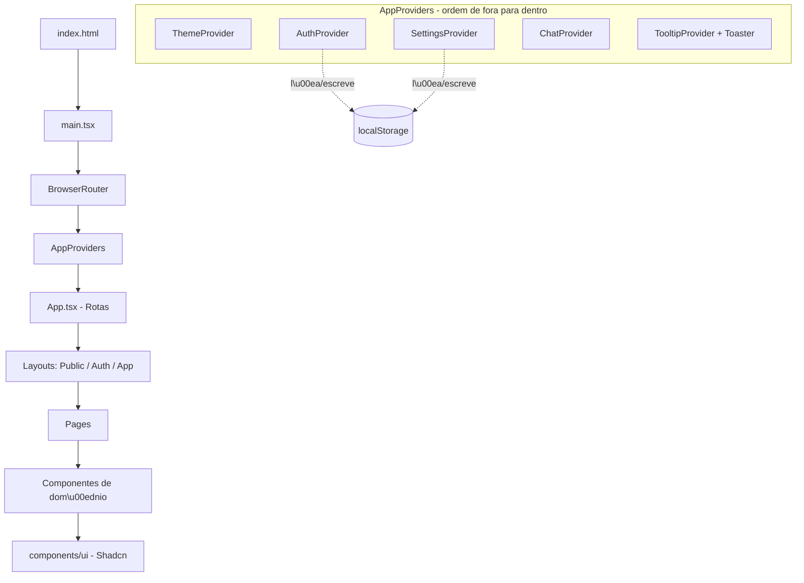
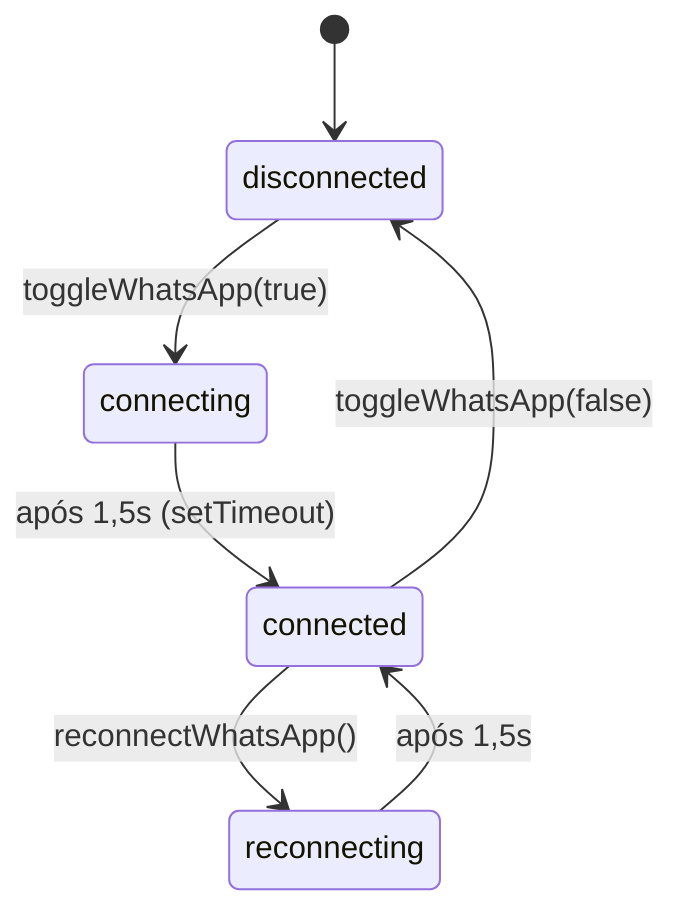

# FlowAssist — Documentação de Arquitetura (Frontend)

> Documento técnico completo. Escrito em linguagem de desenvolvimento, com o objetivo de
> permitir que uma pessoa **júnior** entenda 100% de como a plataforma funciona: a stack, a
> organização das pastas, como o roteamento e o estado funcionam, **onde está mockado e onde
> não está**, e **como criar componentes, páginas e regras novas** seguindo os padrões do
> projeto.

---

## Sumário

1. [Stack e dependências](#1-stack-e-dependências)
2. [Como rodar e scripts](#2-como-rodar-e-scripts)
3. [Visão geral da arquitetura](#3-visão-geral-da-arquitetura)
4. [Estrutura de pastas (real)](#4-estrutura-de-pastas-real)
5. [Bootstrap: do `index.html` ao primeiro render](#5-bootstrap-do-indexhtml-ao-primeiro-render)
6. [Roteamento (React Router)](#6-roteamento-react-router)
7. [Layouts e proteção de rotas](#7-layouts-e-proteção-de-rotas)
8. [Gerenciamento de estado (Contexts)](#8-gerenciamento-de-estado-contexts)
9. [Onde está mockado e onde não está](#9-onde-está-mockado-e-onde-não-está)
10. [Camada de dados: types e mocks](#10-camada-de-dados-types-e-mocks)
11. [Design System (Tailwind + tokens + componentes UI)](#11-design-system-tailwind--tokens--componentes-ui)
12. [Formulários e validação](#12-formulários-e-validação)
13. [Feedback ao usuário (toasts, loading, empty, error)](#13-feedback-ao-usuário-toasts-loading-empty-error)
14. [Convenções e regras do projeto](#14-convenções-e-regras-do-projeto)
15. [Receitas: como fazer X](#15-receitas-como-fazer-x)
16. [Decisões de arquitetura (e por quê)](#16-decisões-de-arquitetura-e-por-quê)
17. [Caminho para produção (remover os mocks)](#17-caminho-para-produção-remover-os-mocks)

---

## 1. Stack e dependências

| Categoria | Tecnologia | Para que serve |
| --- | --- | --- |
| Build/dev server | **Vite 6** | Servidor de desenvolvimento rápido e build de produção |
| Linguagem | **TypeScript 5** | Tipagem estática em todo o código |
| UI | **React 18** | Biblioteca de interface |
| Roteamento | **React Router 7** (`react-router-dom`) | Navegação entre páginas (SPA) |
| Estilo | **TailwindCSS 3** | CSS utilitário |
| Componentes base | **Shadcn/UI** (padrão, copiado para `components/ui`) | Componentes acessíveis sobre Radix UI |
| Primitivos acessíveis | **Radix UI** (`@radix-ui/*`) | Base de dialog, switch, tabs, etc. |
| Ícones | **lucide-react** | Conjunto de ícones |
| Formulários | **react-hook-form** + **zod** + `@hookform/resolvers` | Estado de formulário e validação por schema |
| Tema | **next-themes** | Alternância claro/escuro (usa classe `.dark`) |
| Notificações | **sonner** | Toasts |
| Utilidades de classe | `clsx`, `tailwind-merge`, `class-variance-authority` | Compor classes Tailwind condicionalmente |
| Animações | `tailwindcss-animate` | Keyframes utilitários (fade, slide, zoom) |

> **Shadcn/UI não é uma dependência npm.** É um padrão: os componentes são **copiados** para
> dentro de `src/components/ui/` e nós somos donos do código. Por isso eles aparecem como
> arquivos `.tsx` editáveis, não como `node_modules`.

---

## 2. Como rodar e scripts

```bash
npm install     # instala dependências
npm run dev     # sobe o dev server em http://localhost:5173
npm run build   # type-check (tsc -b) + build de produção (vite build)
npm run preview # serve o build gerado
```

**Credenciais de demonstração** (definidas em `src/lib/constants.ts`):

- Email: `demo@flowassist.com`
- Senha: `demo1234`

Qualquer email válido com senha de 8+ caracteres também loga (cria um usuário mock). Veja
[seção 8](#8-gerenciamento-de-estado-contexts).

---

## 3. Visão geral da arquitetura

É uma **SPA (Single Page Application)** React, sem backend. Todo o estado vive no navegador
(memória React + `localStorage`).



**Fluxo de dados (resumido):**

- A UI lê estado a partir dos **Contexts** (`useAuth`, `useSettings`, `useChat`).
- Ações do usuário chamam funções dos Contexts (ex.: `login`, `toggleWhatsApp`,
  `sendMessage`).
- Os Contexts atualizam o estado React e, quando faz sentido persistir, gravam no
  `localStorage`.

---

## 4. Estrutura de pastas (real)

```
src/
├── app/                      # Bootstrap da aplicação
│   ├── App.tsx               # Definição de TODAS as rotas (React Router)
│   └── providers.tsx         # Composição de todos os Providers/Contexts
│
├── components/
│   ├── ui/                   # Componentes Shadcn (button, card, dialog, ...). NÃO contêm regra de negócio
│   ├── layouts/              # PublicLayout, AuthLayout, AppLayout
│   ├── shared/               # Reutilizáveis entre páginas (sidebar, header, empty-state, ...)
│   ├── landing/              # Seções da página inicial
│   ├── auth/                 # Formulários de login/cadastro/recuperar senha
│   ├── dashboard/            # Blocos do dashboard
│   ├── agent/                # Cards de configuração do "Meu Agente"
│   ├── chat/                 # Tudo do chat (lista, thread, mensagem, input, ...)
│   ├── profile/              # Formulário de perfil
│   └── subscription/         # Card de uso e modal de planos
│
├── contexts/                 # Estado global mockado
│   ├── auth-context.tsx      # Usuário/sessão
│   ├── settings-context.tsx  # Configurações do agente (WhatsApp / Uso Pessoal)
│   └── chat-context.tsx      # Conversas e mensagens
│
├── hooks/
│   ├── use-local-storage.ts  # Hook genérico para ler/escrever no localStorage
│   └── use-mobile.ts         # Detecta breakpoint mobile
│
├── lib/
│   ├── constants.ts          # Rotas, chaves de storage, credenciais demo, etc.
│   ├── utils.ts              # cn() + formatadores de data/iniciais
│   └── validators.ts         # Schemas Zod dos formulários
│
├── mocks/                    # DADOS FALSOS (única fonte de mock de dados)
│   ├── users.ts
│   ├── agent-settings.ts
│   ├── conversations.ts      # conversas + mensagens + respostas automáticas
│   ├── subscription.ts       # assinatura demo + tabela de planos
│   ├── activity.ts
│   └── faq.ts
│
├── pages/                    # Uma página por rota (apenas compõe componentes)
│   ├── LandingPage.tsx  LoginPage.tsx  RegisterPage.tsx  ForgotPasswordPage.tsx
│   ├── DashboardPage.tsx  AgentPage.tsx  ChatPage.tsx
│   ├── ProfilePage.tsx  SubscriptionPage.tsx  SettingsPage.tsx  HelpPage.tsx
│   └── NotFoundPage.tsx
│
├── styles/
│   └── globals.css           # @tailwind + variáveis CSS (tokens de cor) + base styles
│
├── types/
│   └── index.ts              # TODAS as interfaces TypeScript do domínio
│
└── main.tsx                  # Ponto de entrada (monta React no #root)
```

> **Diferenças em relação ao plano original:** consolidamos os types em um único
> `types/index.ts` e os validadores em um único `lib/validators.ts` (em vez de vários
> arquivos), e os mocks de conversas+mensagens+respostas ficam juntos em
> `mocks/conversations.ts`. O `ChatLayout` separado do plano virou responsabilidade da
> própria `ChatPage` (que renderiza em altura cheia dentro do `AppLayout`).

---

## 5. Bootstrap: do `index.html` ao primeiro render

**`index.html`** tem um `<div id="root">` e carrega `src/main.tsx`. Também importa a fonte
Inter via Google Fonts.

**`src/main.tsx`** monta a árvore React na ordem:

```tsx
<StrictMode>
  <BrowserRouter>          {/* habilita roteamento por URL */}
    <AppProviders>         {/* injeta todos os contexts */}
      <App />              {/* define as rotas */}
    </AppProviders>
  </BrowserRouter>
</StrictMode>
```

Também importa o CSS global: `import "@/styles/globals.css"`.

**`src/app/providers.tsx`** empilha os providers. A **ordem importa**: providers mais
internos podem consumir os mais externos.

```tsx
<ThemeProvider>          {/* tema claro/escuro */}
  <AuthProvider>         {/* usuário/sessão */}
    <SettingsProvider>   {/* config do agente */}
      <ChatProvider>     {/* conversas */}
        <TooltipProvider>
          {children}
          <Toaster />    {/* container global de toasts (sonner) */}
        </TooltipProvider>
      </ChatProvider>
    </SettingsProvider>
  </AuthProvider>
</ThemeProvider>
```

> O `@/` é um **alias** que aponta para `src/`. Está configurado em `vite.config.ts`
> (`resolve.alias`) e no `tsconfig` (`paths`). Sempre importe com `@/...` em vez de caminhos
> relativos longos.

---

## 6. Roteamento (React Router)

Todas as rotas vivem em **`src/app/App.tsx`**. O padrão é **layout routes**: um `<Route
element={<Layout/>}>` com rotas-filhas que aparecem no `<Outlet/>` do layout.

```tsx
<Routes>
  {/* Público */}
  <Route element={<PublicLayout />}>
    <Route path="/" element={<LandingPage />} />
  </Route>

  {/* Autenticação */}
  <Route element={<AuthLayout />}>
    <Route path="/login" element={<LoginPage />} />
    <Route path="/cadastro" element={<RegisterPage />} />
    <Route path="/recuperar-senha" element={<ForgotPasswordPage />} />
  </Route>

  {/* Área logada (protegida) */}
  <Route path="/app" element={<AppLayout />}>
    <Route index element={<Navigate to="/app/dashboard" replace />} />
    <Route path="dashboard" element={<DashboardPage />} />
    <Route path="meu-agente" element={<AgentPage />} />
    <Route path="chat" element={<ChatPage />} />
    <Route path="chat/:conversationId" element={<ChatPage />} />
    <Route path="configuracoes" element={<SettingsPage />} />
    <Route path="perfil" element={<ProfilePage />} />
    <Route path="assinatura" element={<SubscriptionPage />} />
    <Route path="ajuda" element={<HelpPage />} />
  </Route>

  <Route path="*" element={<NotFoundPage />} />  {/* 404 */}
</Routes>
```

**Pontos importantes:**

- As URLs em português são a fonte da verdade, mas use sempre o objeto `ROUTES` de
  `src/lib/constants.ts` no código (nunca hardcode strings de rota).
- `chat` e `chat/:conversationId` apontam para a **mesma** `ChatPage`; o parâmetro
  `:conversationId` é lido com `useParams()`.
- Qualquer rota desconhecida cai em `NotFoundPage`.

---

## 7. Layouts e proteção de rotas

Três layouts em `src/components/layouts/`:

### `PublicLayout`
Header da landing + `<Outlet/>` + footer. Sem autenticação.

### `AuthLayout`
Split screen (branding à esquerda, formulário à direita). **Se o usuário já estiver logado,
redireciona para o dashboard** (`<Navigate to={ROUTES.dashboard} />`).

### `AppLayout` (o mais importante)
É o **guard** da área logada e a casca visual do painel:

```tsx
export function AppLayout() {
  const { isAuthenticated } = useAuth();
  if (!isAuthenticated) {
    return <Navigate to={ROUTES.login} replace />;  // proteção de rota
  }
  return (
    <div className="flex h-screen overflow-hidden">
      <aside className="hidden lg:block w-64"><AppSidebar /></aside>  {/* sidebar fixa no desktop */}
      <div className="flex flex-1 flex-col">
        <AppHeader title={...} />          {/* header com menu mobile + tema + user menu */}
        <main className="flex-1 overflow-y-auto"><Outlet /></main>
      </div>
    </div>
  );
}
```

- **Proteção:** sem usuário autenticado → vai para `/login`. Esta é a única barreira (mock).
- **Sidebar dinâmica:** o item "Chat" só aparece quando `personalUse.enabled === true`. A
  lista vem de `src/components/shared/nav-items.ts`; o `AppSidebar` filtra itens com
  `requiresPersonalUse`.
- **Título da página:** derivado da URL casando com `NAV_ITEMS`.
- **Mobile:** a sidebar vira um `Sheet` (drawer) aberto pelo botão de menu no `AppHeader`.

> **Regra extra de proteção no Chat:** `ChatPage` também verifica `personalUse.enabled`. Se
> estiver desligado e o usuário acessar `/app/chat` direto pela URL, ele é redirecionado para
> `/app/meu-agente`.

---

## 8. Gerenciamento de estado (Contexts)

Não usamos Redux/Zustand. O estado global é feito com **React Context + hooks**. Cada context
expõe um hook `useXxx()` que **lança erro** se usado fora do provider (garante uso correto).

### 8.1 `AuthContext` (`contexts/auth-context.tsx`)

Guarda o usuário logado e persiste em `localStorage` (chave `flowassist_auth`).

API exposta por `useAuth()`:

| Campo/Função | Tipo | O que faz |
| --- | --- | --- |
| `user` | `User \| null` | Usuário atual ou nulo |
| `isAuthenticated` | `boolean` | `true` se há usuário |
| `login(email, password)` | `Promise<{ok, error?}>` | Valida credenciais (mock) |
| `register(name, email, password)` | `Promise<{ok}>` | Cria usuário mock e loga |
| `logout()` | `void` | Limpa o usuário |
| `updateProfile({name?, avatarUrl?})` | `void` | Atualiza dados do usuário |

**Regra de login (mock):**
- Se for exatamente `demo@flowassist.com` / `demo1234` → loga como **usuário demo**
  (`DEMO_USER`, que vem com WhatsApp e chat já configurados nos settings demo).
- Senão, se o email tiver `@` e senha ≥ 8 caracteres → cria um usuário novo na hora.
- Caso contrário → retorna `{ ok: false, error: "..." }`.

Há um `delay()` artificial (700–800ms) para simular latência de rede e exibir o estado de
loading dos botões.

### 8.2 `SettingsContext` (`contexts/settings-context.tsx`)

Guarda as configurações do agente. Persiste em `localStorage` (chave `flowassist_settings`).
Valor inicial = `DEMO_SETTINGS`.

API de `useSettings()`:

| Função | O que faz |
| --- | --- |
| `settings` | Objeto `AgentSettings` (whatsapp + personalUse) |
| `toggleWhatsApp(enabled)` | Liga/desliga o WhatsApp |
| `reconnectWhatsApp()` | Refaz a conexão |
| `togglePersonalUse(enabled)` | Liga/desliga o uso pessoal (controla o item Chat na sidebar) |

**Máquina de estados da conexão WhatsApp** (campo `connectionStatus`):



Os `setTimeout` que simulam a conexão ficam guardados num `useRef` para referência. (A
limpeza profunda de timers é um ponto de melhoria, mas inofensivo aqui por serem one-shot.)

### 8.3 `ChatContext` (`contexts/chat-context.tsx`)

Guarda conversas e mensagens. **Vive apenas em memória** (não persiste no localStorage —
reinicia a cada refresh, voltando aos mocks).

API de `useChat()`:

| Função | O que faz |
| --- | --- |
| `conversations` | Lista de `Conversation` (começa em `MOCK_CONVERSATIONS`) |
| `messagesByConversation` | Mapa `{ [conversationId]: Message[] }` |
| `typingConversationId` | Id da conversa onde o assistente está "digitando" (ou null) |
| `createConversation()` | Cria uma conversa vazia e retorna o id |
| `sendMessage(convId, content)` | Adiciona a mensagem do usuário e dispara a resposta mock |
| `getMessages(convId)` | Retorna as mensagens daquela conversa |

**Como a "resposta da IA" é simulada (`sendMessage`):**
1. Adiciona a mensagem do usuário (`role: "user"`).
2. Atualiza o título da conversa (se for a primeira mensagem) e o preview.
3. Marca `typingConversationId` (mostra o `TypingIndicator`).
4. Após um `setTimeout` de 1000–2000ms, escolhe uma resposta **aleatória** de
   `MOCK_ASSISTANT_REPLIES` e adiciona como `role: "assistant"`.
5. Limpa o `typingConversationId`.

> **É aqui que entraria a chamada real de IA** no futuro (ver [seção 17](#17-caminho-para-produção-remover-os-mocks)).

---

## 9. Onde está mockado e onde não está

Esta é a seção mais importante para entender o estado do projeto.

### ✅ É REAL (funciona de verdade no frontend)

- Navegação/roteamento entre todas as telas.
- Renderização e responsividade de toda a UI.
- Validação de formulários (Zod + react-hook-form).
- Tema claro/escuro (persistido).
- Persistência de **sessão** e **configurações do agente** no `localStorage`.
- Toda a lógica de UI: sidebar dinâmica, estados de loading, toasts, empty states,
  auto-scroll do chat, busca de conversas, upload/preview de avatar (lê o arquivo local).

### ❌ É MOCKADO (simulado, não há backend nem IA)

| Área | Onde está o mock | O que é simulado |
| --- | --- | --- |
| **Autenticação** | `contexts/auth-context.tsx` + `mocks/users.ts` | Não há servidor; credenciais validadas no cliente; usuário guardado no localStorage |
| **Conexão WhatsApp** | `contexts/settings-context.tsx` + `mocks/agent-settings.ts` | Número e status "Conectado" são fixos; conexão simulada com `setTimeout` |
| **Respostas do chat (IA)** | `contexts/chat-context.tsx` + `mocks/conversations.ts` | Respostas pré-escritas, escolhidas aleatoriamente após um delay |
| **Conversas/mensagens iniciais** | `mocks/conversations.ts` | Histórico fixo; mensagens novas só vivem em memória |
| **Assinatura/planos** | `pages/SubscriptionPage.tsx` + `mocks/subscription.ts` | Plano, limites e troca de plano são locais (sem cobrança) |
| **Atividades recentes** | `mocks/activity.ts` | Lista estática |
| **FAQ / suporte** | `mocks/faq.ts` + `pages/HelpPage.tsx` | Envio de mensagem só dispara um toast |
| **Recuperar senha** | `components/auth/forgot-password-form.tsx` | Mostra tela de sucesso sem enviar email |

> **Regra mental:** se um dado vem de `src/mocks/` ou de um `setTimeout` dentro de um context,
> é mock. A UI em si é real.

---

## 10. Camada de dados: types e mocks

### `src/types/index.ts`
Contém **todas** as interfaces do domínio. As principais:

- `User` — id, name, email, avatarUrl?, createdAt
- `AgentSettings` — `whatsapp` (enabled, phoneNumber?, connectionStatus, connectedAt?) e
  `personalUse` (enabled)
- `ConnectionStatus` — `"disconnected" | "connecting" | "connected" | "reconnecting"`
- `Conversation`, `Message` (com `role: "user" | "assistant"`)
- `Subscription`, `Plan`, `PlanId`, `UsageLimit`
- `Activity`, `FaqItem`

Sempre que precisar de um novo formato de dado, **declare a interface aqui** e importe com
`import type { ... } from "@/types"`.

### `src/mocks/*`
Cada arquivo exporta dados estáticos e, às vezes, **factories**. Exemplos:

- `users.ts` → `DEMO_USER` e `createMockUser(name, email)` (gera id e avatar via DiceBear).
- `agent-settings.ts` → `DEMO_SETTINGS`, `INITIAL_SETTINGS`, `MOCK_PHONE_NUMBER`.
- `conversations.ts` → `MOCK_CONVERSATIONS`, `MOCK_MESSAGES`, `MOCK_ASSISTANT_REPLIES`.
- `subscription.ts` → `DEMO_SUBSCRIPTION`, `PLANS`.

> Os avatares usam `https://api.dicebear.com/...` — é o único recurso externo, puramente
> cosmético.

---

## 11. Design System (Tailwind + tokens + componentes UI)

### 11.1 Tokens de cor (`src/styles/globals.css`)

Usamos **variáveis CSS em HSL**, no padrão Shadcn. Há um bloco `:root` (tema claro) e um
bloco `.dark` (tema escuro). Exemplos:

```css
:root {
  --primary: 262 83% 58%;      /* violeta — cor de marca */
  --background: 0 0% 100%;
  --foreground: 240 10% 4%;
  --success: 142 76% 36%;      /* WhatsApp conectado */
  --whatsapp: 142 70% 49%;     /* accent pontual do WhatsApp */
  --sidebar: 240 6% 98%;
  --radius: 0.5rem;
}
.dark { --background: 240 10% 4%; /* ... */ }
```

**Por que HSL sem `hsl()`?** Porque o `tailwind.config.js` registra as cores como
`hsl(var(--token))`. Assim, no JSX você usa classes semânticas: `bg-primary`,
`text-muted-foreground`, `border-border`, `bg-success`, etc. — e o tema claro/escuro funciona
automaticamente.

> **Nunca use cor fixa** tipo `bg-[#7c3aed]` ou `text-white` para conteúdo temático. Use os
> tokens (`bg-primary`, `text-primary-foreground`, ...). Isso mantém o dark mode consistente.

### 11.2 `tailwind.config.js`
- `darkMode: ["class"]` → o tema é controlado pela classe `.dark` no `<html>` (gerenciada
  pelo `next-themes`).
- `theme.extend.colors` → mapeia os tokens para classes.
- `keyframes`/`animation` → animações próprias: `fade-in`, `fade-up`, `typing-dot`, além das
  do plugin `tailwindcss-animate`.
- `fontFamily.sans` → Inter.

### 11.3 Componentes `components/ui/` (Shadcn)
São os **blocos de construção burros** (sem regra de negócio): `button`, `input`, `label`,
`textarea`, `card`, `switch`, `badge`, `avatar`, `separator`, `scroll-area`, `skeleton`,
`progress`, `alert`, `dialog`, `sheet`, `dropdown-menu`, `tabs`, `tooltip`, `accordion`,
`sonner`.

Padrões que você verá nesses arquivos:
- **`forwardRef`** para permitir refs.
- **`cn(...)`** (de `lib/utils.ts`) para mesclar classes — combina `clsx` + `tailwind-merge`,
  resolvendo conflitos de classes Tailwind.
- **`cva`** (class-variance-authority) para variantes. Ex.: `button.tsx` define `variant`
  (`default`, `outline`, `ghost`, `destructive`...) e `size`.

Exemplo de uso do `Button` (note a prop `loading`, que é uma extensão nossa):

```tsx
<Button variant="outline" size="sm" loading={isSaving}>Salvar</Button>
```

### 11.4 Ícones
`lucide-react`. Importe o ícone pelo nome e use como componente:
`import { Send } from "lucide-react"` → `<Send className="size-4" />`.

---

## 12. Formulários e validação

Padrão único para **todos** os formulários:

1. Schema **Zod** em `src/lib/validators.ts` (ex.: `loginSchema`, `registerSchema`,
   `profileSchema`).
2. `useForm` do **react-hook-form** com `zodResolver(schema)`.
3. Campos com `{...register("campo")}`.
4. Erros inline: `{errors.campo && <p className="text-xs text-destructive">{errors.campo.message}</p>}`.
5. Submit desabilitado/loading durante a ação assíncrona.

Exemplo real (resumido) de `login-form.tsx`:

```tsx
const { register, handleSubmit, formState: { errors } } =
  useForm<LoginValues>({ resolver: zodResolver(loginSchema) });

async function onSubmit(values: LoginValues) {
  setLoading(true);
  const result = await login(values.email, values.password);
  setLoading(false);
  if (result.ok) { toast.success("Bem-vindo de volta!"); navigate(ROUTES.dashboard); }
  else { toast.error(result.error); }
}
```

> Optamos por usar `register` direto (em vez do wrapper `<Form>` do Shadcn) para manter os
> formulários simples e legíveis. Se um form crescer muito, vale migrar para o `<Form>`.

---

## 13. Feedback ao usuário (toasts, loading, empty, error)

- **Toasts:** `import { toast } from "sonner"`. Use `toast.success`, `toast.error`,
  `toast.message`. O `<Toaster/>` global já está montado em `providers.tsx`.
- **Loading:** botões têm a prop `loading`; o chat tem o `TypingIndicator`; há `Skeleton` em
  `components/ui` para placeholders.
- **Empty states:** componente reutilizável `components/shared/empty-state.tsx`
  (`<EmptyState icon={...} title="..." description="..." action={...} />`). Usado no chat e
  na lista de conversas.
- **Error/validação:** erros de formulário aparecem inline; há `components/ui/alert.tsx`
  (variante `destructive`) para erros maiores.

---

## 14. Convenções e regras do projeto

1. **Idioma:** UI e textos em **Português (Brasil)**. Código (nomes de variáveis/funções) em
   inglês.
2. **Imports:** sempre via alias `@/` (ex.: `@/components/ui/button`).
3. **Rotas:** sempre via `ROUTES` (`@/lib/constants`). Nunca hardcode `"/app/chat"`.
4. **Nomes de arquivo:**
   - Componentes `ui/`, `shared/`, e de domínio: **kebab-case** (`chat-input.tsx`).
   - Layouts e Pages: **PascalCase** (`AppLayout.tsx`, `DashboardPage.tsx`).
5. **Pages são "burras":** apenas compõem componentes; lógica fica em contexts/hooks/componentes.
6. **Sem regra de negócio em `components/ui/`:** esses são genéricos e reutilizáveis.
7. **Tipos no `@/types`**, mocks em `@/mocks`, schemas em `@/lib/validators`.
8. **Cores só via tokens** (`bg-primary`, `text-muted-foreground`, ...). Sem hex fixo para
   conteúdo temático.
9. **`cn()` sempre** que precisar de classes condicionais.
10. **Linguagem para o cliente:** nunca exponha "IA"/"agente"/"mock" na UI. Use "assistente".
11. **Persistência:** chaves de `localStorage` centralizadas em `STORAGE_KEYS`
    (`@/lib/constants`).

---

## 15. Receitas: como fazer X

### 15.1 Criar um componente de UI novo (genérico)
1. Crie `src/components/ui/meu-componente.tsx`.
2. Use `forwardRef`, `cn()` e, se houver variantes, `cva`.
3. Exporte o componente (e o `variants` se aplicável).
4. Não coloque regra de negócio nem chamadas a contexts aqui.

### 15.2 Criar um componente de domínio
1. Escolha a pasta certa (`dashboard/`, `agent/`, `chat/`, etc.) — ou `shared/` se for
   reutilizável entre páginas.
2. Nomeie em kebab-case.
3. Consuma dados via hooks de context (`useAuth`, `useSettings`, `useChat`) e componha com
   `components/ui`.

### 15.3 Adicionar uma página/rota nova
1. Crie `src/pages/MinhaPage.tsx` (PascalCase). Use `PageContainer` + `PageHeader` para
   manter o padrão visual:
   ```tsx
   export function MinhaPage() {
     return (
       <PageContainer>
         <PageHeader title="Minha Página" description="..." />
         {/* conteúdo */}
       </PageContainer>
     );
   }
   ```
2. Adicione a rota em `src/app/App.tsx`, dentro do layout adequado.
3. Adicione a constante em `ROUTES` (`src/lib/constants.ts`).
4. Se a página deve aparecer no menu, adicione um item em
   `src/components/shared/nav-items.ts` (com `icon` do lucide; use `requiresPersonalUse` se
   for condicional).

### 15.4 Adicionar um item no menu lateral
Edite `src/components/shared/nav-items.ts`:
```ts
{ label: "Relatórios", to: ROUTES.reports, icon: BarChart3 }
```
O `AppSidebar` renderiza automaticamente. Use `requiresPersonalUse: true` para itens
condicionais.

### 15.5 Criar um formulário com validação
1. Defina o schema em `src/lib/validators.ts` e exporte o tipo (`z.infer`).
2. Use `useForm({ resolver: zodResolver(schema) })`.
3. Siga o padrão da [seção 12](#12-formulários-e-validação).

### 15.6 Adicionar/alterar dados mock
- Dados estáticos → edite o arquivo correspondente em `src/mocks/`.
- Novo formato de dado → declare a interface em `src/types/index.ts` primeiro.

### 15.7 Adicionar uma cor/token ao design system
1. Adicione a variável em `:root` **e** em `.dark` no `globals.css`.
2. Mapeie em `tailwind.config.js` (`theme.extend.colors`).
3. Use como classe: `bg-minhacor`.

---

## 16. Decisões de arquitetura (e por quê)

| Decisão | Por quê |
| --- | --- |
| **Context API** em vez de Redux/Zustand | Estado pequeno e simples; menos boilerplate; suficiente para um MVP mockado |
| **Mocks isolados em `src/mocks` + lógica em contexts** | Facilita trocar mock por API real depois sem mexer na UI |
| **Shadcn copiado em `components/ui`** | Controle total do código dos componentes; sem lock-in de lib externa |
| **Tokens HSL + Tailwind** | Tema claro/escuro trivial; consistência visual; classes semânticas |
| **`localStorage` para auth/settings, memória para chat** | Sessão e config devem sobreviver ao refresh; conversas são efêmeras na demo |
| **Pages "burras" + componentes de domínio** | Separação de responsabilidades; páginas legíveis; componentes reutilizáveis |
| **Validação com Zod** | Schema único como fonte da verdade; tipos derivados automaticamente |
| **`ROUTES`/`STORAGE_KEYS` centralizados** | Evita strings mágicas espalhadas; refator seguro |
| **Proteção de rota só no `AppLayout` (+guard no Chat)** | Simples e suficiente para mock; ponto único para evoluir com auth real |

---

## 17. Caminho para produção (remover os mocks)

A arquitetura foi pensada para que sair do mock para o real toque **principalmente os
contexts**, não a UI. Roteiro sugerido:

1. **Camada de API:** criar `src/lib/api.ts` (fetch/axios) e, idealmente, hooks de dados
   (ex.: TanStack Query).
2. **Auth real:** em `auth-context.tsx`, trocar a validação local por chamadas à API
   (login/registro/refresh). Trocar `localStorage` de usuário por tokens seguros.
3. **WhatsApp real:** em `settings-context.tsx`, trocar os `setTimeout` pelo fluxo real de
   conexão (ex.: OAuth/QR + webhooks). O `connectionStatus` passa a refletir o backend.
4. **IA real:** em `chat-context.tsx`, no `sendMessage`, substituir a escolha de
   `MOCK_ASSISTANT_REPLIES` por uma chamada ao backend/LLM (idealmente com streaming).
   O `TypingIndicator` já está pronto para isso.
5. **Assinatura real:** integrar checkout (ex.: Stripe) na `SubscriptionPage` e buscar plano
   atual da API.
6. **Mocks:** os arquivos em `src/mocks/` deixam de ser a fonte e viram apenas fallback de
   testes/Storybook (ou são removidos).

> Como a UI só conversa com os contexts (e não com os mocks diretamente), trocar a fonte de
> dados não deve exigir reescrever telas — apenas a implementação interna dos providers e a
> adição da camada de API.

---

### Referências cruzadas
- Visão de produto e jornadas: [`PRODUTO.md`](./PRODUTO.md)
- Planejamento original completo (sitemap, fluxos, design system, roadmap):
  [`PLANEJAMENTO.md`](./PLANEJAMENTO.md)
