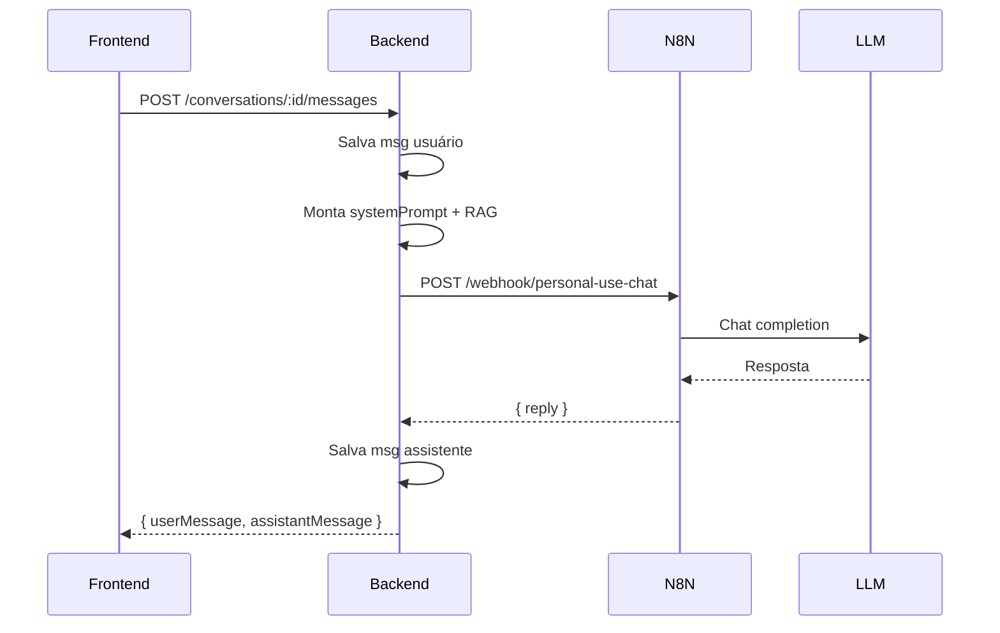
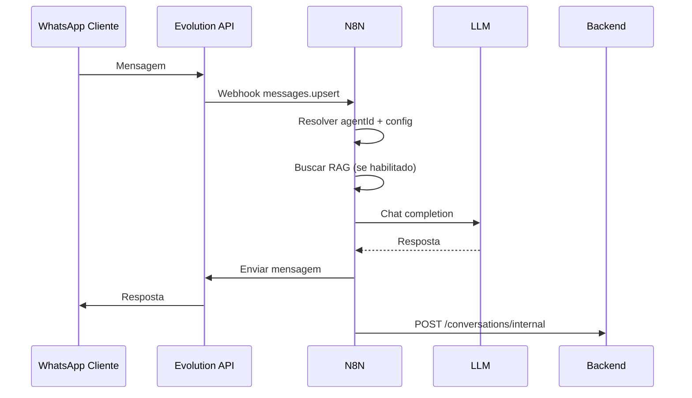

# FlowAssist — Integração N8N

> Este documento descreve **exclusivamente o que precisa existir dentro do N8N** para a plataforma FlowAssist funcionar em produção. Não explica o backend — apenas os workflows, contratos, endpoints consumidos e pontos de gancho para sair do mock mode.
>
> **Público-alvo:** equipe que implementará os workflows N8N sem precisar ler o código-fonte do backend.

---

## Sumário

1. [Visão geral](#1-visão-geral)
2. [Autenticação entre serviços](#2-autenticação-entre-serviços)
3. [Feature flags e mock mode](#3-feature-flags-e-mock-mode)
4. [Fluxos](#4-fluxos)
   - [4.1 Chat interno (uso pessoal)](#41-chat-interno-uso-pessoal)
   - [4.2 WhatsApp](#42-whatsapp)
   - [4.3 Consulta ao conhecimento](#43-consulta-ao-conhecimento)
   - [4.4 Recuperação de contexto](#44-recuperação-de-contexto)
   - [4.5 RAG (vetorização e busca)](#45-rag-vetorização-e-busca)
   - [4.6 Upload de arquivos](#46-upload-de-arquivos)
   - [4.7 Processamento de arquivos](#47-processamento-de-arquivos)
5. [Workflows do N8N](#5-workflows-do-n8n)
6. [Endpoints consumidos pelo N8N](#6-endpoints-consumidos-pelo-n8n)
7. [Webhooks expostos pelo N8N (chamados pelo backend)](#7-webhooks-expostos-pelo-n8n-chamados-pelo-backend)
8. [Contratos de dados](#8-contratos-de-dados)
9. [Mapa de ganchos no código do backend](#9-mapa-de-ganchos-no-código-do-backend)
10. [Variáveis de ambiente](#10-variáveis-de-ambiente)
11. [Roadmap futuro](#11-roadmap-futuro)

---

## 1. Visão geral

O FlowAssist é composto por três camadas:

```
┌─────────────────────┐
│  Frontend (React)   │  Interface do usuário
└─────────┬───────────┘
          │  HTTP REST + JWT
          ▼
┌─────────────────────┐
│  Backend (API)      │  Dados, autenticação, orquestração
└─────────┬───────────┘
          │  HTTP webhooks (ida e volta)
          ▼
┌─────────────────────┐
│  N8N                │  Orquestração de IA, RAG, WhatsApp
└─────────┬───────────┘
          │
    ┌─────┴─────┬──────────────┐
    ▼           ▼              ▼
  LLM      Evolution API    Storage
(OpenAI,   (WhatsApp)      (arquivos)
Anthropic,
 Gemini)
```

### Papel do N8N

O N8N é o **motor de inteligência** da plataforma. Ele:

- Recebe mensagens (chat interno e WhatsApp) e gera respostas via LLM.
- Processa arquivos da base de conhecimento (extração, chunking, embeddings).
- Executa busca semântica (RAG) quando necessário.
- Traduz eventos da Evolution API em status de conexão WhatsApp.
- Persiste histórico de conversas WhatsApp no backend.

O backend **não chama LLM diretamente** em produção — delega ao N8N via webhooks. O backend **não processa arquivos** em produção — dispara o workflow de processamento no N8N.

### Direção das chamadas

| Direção | Quem inicia | Protocolo | Autenticação |
| --- | --- | --- | --- |
| Backend → N8N | Backend | `POST {N8N_URL}/webhook/{path}` | Header `x-webhook-secret: {N8N_WEBHOOK_SECRET}` |
| N8N → Backend | N8N | `PUT/POST {API_URL}/api/...` | Header `x-webhook-secret: {WEBHOOK_SECRET}` |
| Evolution → N8N | Evolution API | Webhook configurado no N8N | Conforme Evolution |
| Evolution → Backend | Evolution API (opcional) | `POST {API_URL}/api/webhooks/evolution` | Header `x-webhook-secret: {WEBHOOK_SECRET}` |

---

## 2. Autenticação entre serviços

### N8N → Backend (callbacks)

Todas as rotas de callback do backend exigem:

```
x-webhook-secret: {WEBHOOK_SECRET}
```

Rotas protegidas:
- `PUT /api/knowledge/files/:fileId`
- `POST /api/knowledge/files/:fileId/chunks`
- `POST /api/conversations/internal`
- `PUT /api/webhooks/whatsapp-status`
- `POST /api/webhooks/evolution`

### Backend → N8N (disparo de workflows)

O backend envia em todas as chamadas:

```
x-webhook-secret: {N8N_WEBHOOK_SECRET}
```

O N8N deve validar esse header nos webhooks de entrada.

---

## 3. Feature flags e mock mode

O backend roda standalone por padrão com três flags:

| Flag | Default | Quando `true` | Quando `false` |
| --- | --- | --- | --- |
| `MOCK_AI` | `true` | Respostas simuladas no chat interno | Chama webhook `personal-use-chat` do N8N |
| `MOCK_RAG` | `true` | Processamento de arquivos simulado com timers | Dispara webhook `knowledge-file-processing` do N8N |
| `MOCK_WHATSAPP` | `true` | Conexão WhatsApp simulada | Chama Evolution API real |

**Para ativar o N8N em produção**, defina as três flags como `false` e configure as URLs/secrets correspondentes.

---

## 4. Fluxos

### 4.1 Chat interno (uso pessoal)

Canal: `personalUse`. O usuário conversa com o agente pela interface web.

```
1. Usuário digita mensagem no frontend
2. Frontend → POST /api/conversations/:id/messages { content }
3. Backend salva mensagem do usuário no banco
4. Backend monta o system prompt (instruções + personalidade + RAG)
5. Backend recupera histórico recente (últimas 12 mensagens)
6. [MOCK_AI=false] Backend → POST {N8N}/webhook/personal-use-chat
7. N8N Workflow 05 executa LLM com system prompt + histórico + mensagem
8. N8N retorna { reply: "..." }
9. Backend salva resposta do assistente
10. Backend → { userMessage, assistantMessage } para o frontend
```

**Personalidade e instruções:** o backend já resolve a herança por canal antes de chamar o N8N. O payload inclui o `systemPrompt` montado e a `personality` resolvida.

**Base de conhecimento:** se `useSharedKnowledgeBase=true` no canal `personalUse`, o backend faz busca textual (mock) ou vetorial (produção) e inclui o contexto em `knowledgeContext`.

### 4.2 WhatsApp

Canal: `whatsapp`. Mensagens chegam via Evolution API, não pelo frontend.

```
1. Cliente envia mensagem no WhatsApp
2. Evolution API → webhook do N8N (Workflow 01)
3. N8N identifica a instância → agentId
4. N8N busca configuração do agente/canal (Workflow 02)
5. N8N resolve personalidade e instruções do canal whatsapp (Workflow 03)
6. N8N busca conhecimento relevante (Workflow 04) se useSharedKnowledgeBase=true
7. N8N recupera histórico da conversa (Workflow 06 — contexto)
8. N8N executa LLM (Workflow 05)
9. N8N envia resposta via Evolution API
10. N8N → POST /api/conversations/internal (salva histórico no backend)
11. Backend atualiza contadores de uso (whatsappMsgsUsed)
```

**Conexão WhatsApp (QR code):**

```
1. Usuário clica "Conectar" no frontend
2. Frontend → POST /api/agent/whatsapp/connect
3. Backend cria instância na Evolution API (instanceName = flowassist-{agentId8chars})
4. Backend salva status "connecting" + qrCode
5. Evolution emite eventos de QR/conexão → N8N (Workflow 08)
6. N8N normaliza evento → PUT /api/webhooks/whatsapp-status
7. Backend atualiza connectionStatus, phoneNumber, connectedAt
8. Frontend faz polling em GET /api/agent/whatsapp/status
```

### 4.3 Consulta ao conhecimento

Usada durante a geração de respostas (chat e WhatsApp).

```
1. N8N recebe a mensagem do usuário (query)
2. N8N precisa do agentId e saber se o canal usa base compartilhada
3. N8N → POST /api/knowledge/search { query, topK }
   (requer JWT do usuário OU endpoint interno com webhook secret — ver nota)
4. Backend retorna trechos relevantes com score
5. N8N injeta trechos no prompt do LLM
```

> **Nota de implementação:** o endpoint `POST /api/knowledge/search` hoje exige JWT do usuário. Para workflows N8N (sem sessão de usuário), duas opções:
> - **Recomendado:** o N8N chama a busca passando `agentId` em um endpoint interno futuro (`POST /api/internal/knowledge/search` com webhook secret).
> - **Alternativa:** o backend já inclui `knowledgeContext` no payload do webhook `personal-use-chat`. Para WhatsApp, o Workflow 04 deve implementar a busca diretamente no banco vetorial ou chamar um endpoint interno.

### 4.4 Recuperação de contexto

Histórico de conversa para manter coerência nas respostas.

**Chat interno:** o backend envia as últimas 12 mensagens no campo `history` do webhook `personal-use-chat`.

**WhatsApp:** o N8N deve:

```
1. Localizar conversa existente por externalId (número do contato + agentId)
2. Se não existir, criar nova conversa via POST /api/conversations/internal
3. Buscar mensagens anteriores (futuro: GET /api/internal/conversations/:id/messages)
4. Incluir histórico no prompt do LLM (últimas N mensagens)
```

Hoje o N8N pode manter contexto em memória/Redis por `externalId` ou consultar o backend via endpoint interno a ser exposto.

### 4.5 RAG (vetorização e busca)

Pipeline completo de Retrieval-Augmented Generation:

```
Upload (frontend)
  → Backend salva arquivo no storage
  → Backend dispara N8N webhook "knowledge-file-processing"
  → N8N baixa arquivo do storageUrl
  → N8N extrai texto (PDF/DOCX/XLSX/CSV/TXT/imagem OCR)
  → N8N divide em chunks (500-1000 tokens, overlap 10%)
  → N8N gera embeddings (OpenAI text-embedding-3-small, 1536 dims)
  → N8N → POST /api/knowledge/files/:id/chunks { chunks: [...] }
  → N8N → PUT /api/knowledge/files/:id { status: "ready", chunks, vectors, indexedAt }
  → Frontend reflete status via polling
```

**Busca semântica em produção:**

```sql
-- Exemplo de query vetorial (pgvector, cosine distance)
SELECT content, file_id, chunk_index,
       1 - (embedding <=> $1::vector) AS score
FROM knowledge_chunks
WHERE agent_id = $2
ORDER BY embedding <=> $1::vector
LIMIT $3;
```

### 4.6 Upload de arquivos

O upload é feito **diretamente pelo frontend ao backend** (multipart). O N8N **não participa** do upload.

```
1. Frontend → POST /api/knowledge/files (multipart, campo "file")
2. Backend valida tamanho (MAX_UPLOAD_BYTES, default 20MB)
3. Backend salva em storage local (ou S3 futuro) → storageUrl
4. Backend cria registro com status "uploading"
5. Backend dispara processamento (mock ou N8N)
```

Formatos suportados (preparados no schema, processamento futuro no N8N):

| Extensão | type no banco | Extração sugerida no N8N |
| --- | --- | --- |
| `.pdf` | `pdf` | pdf-parse / PyMuPDF |
| `.docx` | `docx` | mammoth / python-docx |
| `.xlsx` | `xlsx` | xlsx / openpyxl |
| `.csv` | `csv` | parsing direto |
| `.txt` | `txt` | leitura direta |
| `.png/.jpg` | `image` | OCR (Tesseract / Vision API) |
| outros | `other` | tentativa genérica ou erro |

### 4.7 Processamento de arquivos

Detalhamento do Workflow 07:

```
Entrada: { fileId, agentId, storageUrl, fileType }

Passo 1 — Atualizar status
  PUT /api/knowledge/files/:fileId
  { "status": "processing", "progress": 0 }

Passo 2 — Baixar arquivo
  GET {storageUrl} (arquivo local ou URL assinada S3)

Passo 3 — Extrair texto conforme fileType

Passo 4 — Chunking
  Dividir em trechos de ~800 tokens com overlap de 80 tokens
  Atualizar progresso periodicamente:
  PUT /api/knowledge/files/:fileId { "progress": 45 }

Passo 5 — Gerar embeddings
  Para cada chunk: chamar API de embedding (OpenAI, etc.)
  Atualizar progresso: { "progress": 80 }

Passo 6 — Salvar chunks
  POST /api/knowledge/files/:fileId/chunks
  { "chunks": [{ "content": "...", "chunkIndex": 0, "embedding": [0.1, ...] }] }

Passo 7 — Finalizar
  PUT /api/knowledge/files/:fileId
  {
    "status": "ready",
    "chunks": 42,
    "vectors": 42,
    "indexedAt": "2025-06-19T12:00:00.000Z"
  }

Em caso de erro:
  PUT /api/knowledge/files/:fileId
  { "status": "error", "errorMessage": "Descrição do erro" }
```

---

## 5. Workflows do N8N

### Workflow 01 — Receber mensagem WhatsApp

| Item | Valor |
| --- | --- |
| **Trigger** | Webhook da Evolution API (`messages.upsert` ou equivalente) |
| **Entrada** | Payload bruto da Evolution (instance, data.key.remoteJid, data.message.conversation) |
| **Saída** | Dispara Workflow 02 com `{ agentId, contactPhone, contactName, message, instanceName }` |

**Nodes sugeridos:**
1. Webhook (Evolution)
2. Function — extrair texto da mensagem (suportar texto, áudio transcrito, imagem)
3. HTTP Request — resolver `agentId` a partir de `instanceName` (consulta interna ou mapa)
4. Execute Workflow → Workflow 02

---

### Workflow 02 — Buscar agente e configuração

| Item | Valor |
| --- | --- |
| **Trigger** | Chamado pelo Workflow 01 ou 05 |
| **Entrada** | `{ agentId, channelId: "whatsapp" \| "personalUse" }` |
| **Saída** | Configuração completa do agente para o canal |

**Dados necessários (montar a partir do banco ou cache):**

```json
{
  "agentId": "uuid",
  "agentName": "Assistente FlowAssist",
  "baseInstructions": "Você é o assistente...",
  "basePersonality": { "temperature": 50, "creativity": 50, ... },
  "channel": {
    "channelId": "whatsapp",
    "enabled": true,
    "useSharedPersonality": false,
    "useSharedKnowledgeBase": true,
    "personality": { ... },
    "instructions": "Seja breve..."
  }
}
```

> Em produção, o N8N pode consultar o PostgreSQL diretamente (tabelas `agents`, `channel_configs`) ou um endpoint interno do backend.

---

### Workflow 03 — Montar personalidade e prompt

| Item | Valor |
| --- | --- |
| **Trigger** | Sub-workflow chamado por 01, 05 |
| **Entrada** | Dados do Workflow 02 + `knowledgeContext` (opcional) |
| **Saída** | `{ systemPrompt, personality, llmParams }` |

**Lógica de herança:**

```
SE channel.useSharedPersonality = true
  ENTÃO personality = basePersonality
SENÃO
  personality = channel.personality

systemPrompt =
  baseInstructions
  + channel.instructions (se houver)
  + diretrizes de estilo (traduzir personality em texto)
  + knowledgeContext (se houver)
```

**Mapeamento personality → parâmetros LLM:**

| Campo | Uso no LLM |
| --- | --- |
| `temperature` | `temperature` (0-1, dividir por 100) |
| `creativity` | Influencia `top_p` |
| `formality` | Diretriz no system prompt |
| `objectivity` | Diretriz no system prompt |
| `technicalLevel` | Diretriz no system prompt |
| `writingStyle` | Diretriz no system prompt |
| `emojiUsage` | Diretriz no system prompt |
| `responseLength` | `max_tokens` (curta=256, media=512, longa=1024) |

---

### Workflow 04 — Buscar conhecimento (RAG)

| Item | Valor |
| --- | --- |
| **Trigger** | Sub-workflow |
| **Entrada** | `{ agentId, query, topK: 5, useSharedKnowledgeBase: true }` |
| **Saída** | `{ hits: [{ content, score, fileId, chunkIndex }] }` |

**Quando executar:** apenas se `useSharedKnowledgeBase=true` no canal.

**Implementação:**
1. Gerar embedding da `query` (mesmo modelo usado no indexação).
2. Busca vetorial no PostgreSQL (pgvector) filtrando por `agent_id`.
3. Retornar top-K trechos ordenados por similaridade.

---

### Workflow 05 — Executar LLM

| Item | Valor |
| --- | --- |
| **Trigger** | Webhook `personal-use-chat` (backend) OU sub-workflow (WhatsApp) |
| **Entrada** | Ver [seção 7.1](#71-personal-use-chat) |
| **Saída** | `{ reply: "texto da resposta" }` |

**Nodes sugeridos:**
1. Webhook (path: `personal-use-chat`)
2. Validar `x-webhook-secret`
3. Montar messages array: `[{ role: "system", content: systemPrompt }, ...history, { role: "user", content: userMessage }]`
4. HTTP Request → OpenAI/Anthropic/Gemini
5. Function — extrair texto da resposta
6. Respond to Webhook → `{ reply }`

---

### Workflow 06 — Salvar histórico

| Item | Valor |
| --- | --- |
| **Trigger** | Após Workflow 05 (WhatsApp) |
| **Entrada** | `{ agentId, contactPhone, contactName, externalId, userMessage, assistantMessage }` |
| **Saída** | Conversa persistida no backend |

**Chamada:**

```
POST /api/conversations/internal
x-webhook-secret: {WEBHOOK_SECRET}

{
  "agentId": "uuid",
  "channel": "whatsapp",
  "externalId": "5511999999999@s.whatsapp.net",
  "contactName": "João Silva",
  "contactPhone": "+55 11 99999-9999",
  "messages": [
    { "role": "user", "content": "Olá, qual o prazo de entrega?" },
    { "role": "assistant", "content": "O prazo é de 3 a 5 dias úteis." }
  ]
}
```

---

### Workflow 07 — Processar arquivo (RAG)

| Item | Valor |
| --- | --- |
| **Trigger** | Webhook `knowledge-file-processing` (backend) |
| **Entrada** | `{ fileId, agentId, storageUrl, fileType }` |
| **Saída** | Chunks salvos + status `ready` no backend |

Ver fluxo detalhado na [seção 4.7](#47-processamento-de-arquivos).

---

### Workflow 08 — Eventos de conexão WhatsApp

| Item | Valor |
| --- | --- |
| **Trigger** | Webhook da Evolution API (connection.update, qrcode.updated) |
| **Entrada** | Payload bruto da Evolution |
| **Saída** | Status atualizado no backend |

**Normalização de eventos:**

| Evento Evolution | connectionStatus |
| --- | --- |
| `qrcode.updated` | `connecting` |
| `connection.open` | `connected` |
| `connection.close` | `disconnected` |
| reconexão automática | `reconnecting` |

**Chamada ao backend:**

```
PUT /api/webhooks/whatsapp-status
x-webhook-secret: {WEBHOOK_SECRET}

{
  "instanceName": "flowassist-a1b2c3d4",
  "connectionStatus": "connected",
  "phoneNumber": "+55 11 98765-4321",
  "connectedAt": "2025-06-19T12:00:00.000Z",
  "qrCode": null
}
```

---

## 6. Endpoints consumidos pelo N8N

Base URL: `{API_URL}` (ex.: `http://localhost:3000`).

### 6.1 Atualizar status de arquivo

| Campo | Valor |
| --- | --- |
| **Método** | `PUT` |
| **URL** | `/api/knowledge/files/:fileId` |
| **Auth** | `x-webhook-secret: {WEBHOOK_SECRET}` |
| **Quando chamar** | Durante e após processamento de arquivo (Workflow 07) |

**Payload:**

```json
{
  "status": "processing",
  "progress": 45,
  "errorMessage": null,
  "chunks": 42,
  "vectors": 42,
  "indexedAt": "2025-06-19T12:00:00.000Z"
}
```

**Resposta:**

```json
{
  "id": "uuid",
  "name": "catalogo.pdf",
  "type": "pdf",
  "sizeBytes": 2412544,
  "status": "ready",
  "chunks": 42,
  "vectors": 42,
  "indexedAt": "2025-06-19T12:00:00.000Z",
  "uploadedAt": "2025-06-19T11:00:00.000Z"
}
```

---

### 6.2 Salvar chunks com embeddings

| Campo | Valor |
| --- | --- |
| **Método** | `POST` |
| **URL** | `/api/knowledge/files/:fileId/chunks` |
| **Auth** | `x-webhook-secret: {WEBHOOK_SECRET}` |
| **Quando chamar** | Após gerar embeddings (Workflow 07, passo 6) |

**Payload:**

```json
{
  "chunks": [
    {
      "content": "Trecho do documento...",
      "chunkIndex": 0,
      "embedding": [0.012, -0.034, 0.056, "... 1536 valores"]
    },
    {
      "content": "Outro trecho...",
      "chunkIndex": 1,
      "embedding": [0.023, -0.045, 0.067, "..."]
    }
  ]
}
```

**Resposta:**

```json
{ "saved": 2 }
```

---

### 6.3 Salvar histórico de conversa (WhatsApp)

| Campo | Valor |
| --- | --- |
| **Método** | `POST` |
| **URL** | `/api/conversations/internal` |
| **Auth** | `x-webhook-secret: {WEBHOOK_SECRET}` |
| **Quando chamar** | Após gerar e enviar resposta WhatsApp (Workflow 06) |

**Payload:**

```json
{
  "agentId": "uuid-do-agente",
  "channel": "whatsapp",
  "externalId": "5511999999999@s.whatsapp.net",
  "contactName": "João Silva",
  "contactPhone": "+55 11 99999-9999",
  "title": "João Silva",
  "messages": [
    { "role": "user", "content": "Mensagem do cliente" },
    { "role": "assistant", "content": "Resposta do agente" }
  ]
}
```

**Resposta:**

```json
{
  "id": "uuid-da-conversa",
  "title": "João Silva",
  "lastMessage": "Resposta do agente",
  "lastMessageAt": "2025-06-19T12:00:00.000Z",
  "messageCount": 2
}
```

---

### 6.4 Atualizar status de conexão WhatsApp

| Campo | Valor |
| --- | --- |
| **Método** | `PUT` |
| **URL** | `/api/webhooks/whatsapp-status` |
| **Auth** | `x-webhook-secret: {WEBHOOK_SECRET}` |
| **Quando chamar** | Ao receber eventos da Evolution (Workflow 08) |

**Payload:**

```json
{
  "instanceName": "flowassist-a1b2c3d4",
  "connectionStatus": "connected",
  "phoneNumber": "+55 11 98765-4321",
  "connectedAt": "2025-06-19T12:00:00.000Z",
  "qrCode": "data:image/png;base64,..."
}
```

**Valores de `connectionStatus`:** `disconnected` | `connecting` | `connected` | `reconnecting`

**Resposta:**

```json
{
  "connectionStatus": "connected",
  "phoneNumber": "+55 11 98765-4321",
  "connectedAt": "2025-06-19T12:00:00.000Z"
}
```

---

### 6.5 Busca na base de conhecimento (referência)

| Campo | Valor |
| --- | --- |
| **Método** | `POST` |
| **URL** | `/api/knowledge/search` |
| **Auth** | `Authorization: Bearer {JWT}` (hoje) |
| **Quando chamar** | Durante geração de resposta quando precisar de contexto RAG |

**Payload:**

```json
{
  "query": "qual o prazo de entrega?",
  "topK": 5
}
```

**Resposta:**

```json
[
  {
    "content": "O prazo de entrega é de 3 a 5 dias úteis...",
    "score": 0.92,
    "fileId": "uuid",
    "chunkIndex": 3
  }
]
```

> Para workflows N8N sem JWT, implementar busca vetorial diretamente no PostgreSQL (recomendado) ou solicitar endpoint interno com webhook secret.

---

## 7. Webhooks expostos pelo N8N (chamados pelo backend)

Base URL: `{N8N_URL}` (ex.: `http://localhost:5678`).

Todas as chamadas do backend incluem:
```
Content-Type: application/json
x-webhook-secret: {N8N_WEBHOOK_SECRET}
```

### 7.1 personal-use-chat

| Campo | Valor |
| --- | --- |
| **Método** | `POST` |
| **URL** | `{N8N_URL}/webhook/personal-use-chat` |
| **Quando** | `MOCK_AI=false` e usuário envia mensagem no chat interno |

**Payload enviado pelo backend:**

```json
{
  "systemPrompt": "Você é o assistente...\n\nDiretrizes de estilo:\n- Formalidade: equilibrado...",
  "history": [
    { "role": "user", "content": "mensagem anterior" },
    { "role": "assistant", "content": "resposta anterior" }
  ],
  "userMessage": "nova mensagem do usuário",
  "personality": {
    "temperature": 55,
    "creativity": 60,
    "formality": 65,
    "objectivity": 60,
    "technicalLevel": 70,
    "writingStyle": "detalhado",
    "emojiUsage": "nunca",
    "responseLength": "longa"
  },
  "knowledgeContext": "Trecho relevante da base...\n---\nOutro trecho..."
}
```

**Resposta esperada:**

```json
{
  "reply": "Texto da resposta do assistente."
}
```

---

### 7.2 knowledge-file-processing

| Campo | Valor |
| --- | --- |
| **Método** | `POST` |
| **URL** | `{N8N_URL}/webhook/knowledge-file-processing` |
| **Quando** | `MOCK_RAG=false` e usuário faz upload de arquivo |

**Payload enviado pelo backend:**

```json
{
  "fileId": "uuid-do-arquivo",
  "agentId": "uuid-do-agente",
  "storageUrl": "/uploads/uuid-catalogo.pdf",
  "fileType": "pdf"
}
```

**Resposta:** fire-and-forget (backend não aguarda). O N8N atualiza o backend via callbacks (seção 6).

---

### 7.3 whatsapp-incoming (sugerido — implementar no N8N)

| Campo | Valor |
| --- | --- |
| **Método** | Webhook da Evolution API → N8N |
| **URL** | Configurado na Evolution, apontando para Workflow 01 |
| **Quando** | Cliente envia mensagem no WhatsApp |

Este webhook **não é chamado pelo backend** — é configurado na Evolution API apontando diretamente para o N8N.

---

## 8. Contratos de dados

### 8.1 AgentPersonality

```typescript
interface AgentPersonality {
  temperature: number;       // 0-100
  creativity: number;        // 0-100
  formality: number;         // 0-100
  objectivity: number;       // 0-100
  technicalLevel: number;    // 0-100
  writingStyle: "conciso" | "equilibrado" | "detalhado" | "narrativo";
  emojiUsage: "nunca" | "as_vezes" | "frequente";
  responseLength: "curta" | "media" | "longa";
}
```

### 8.2 ChannelId

Valores aceitos: `"personalUse"` | `"whatsapp"` (camelCase, alinhado ao frontend).

### 8.3 KnowledgeFile status

`"uploading"` → `"processing"` → `"ready"` | `"error"`

### 8.4 Message role

`"user"` | `"assistant"`

### 8.5 Embedding

- Dimensão: **1536** (OpenAI `text-embedding-3-small`)
- Armazenamento: coluna `embedding vector(1536)` no PostgreSQL (pgvector)
- Formato no callback: array de números `[0.012, -0.034, ...]`

### 8.6 Mapeamento instância → agente

O backend cria instâncias WhatsApp com o padrão:

```
instanceName = "flowassist-" + agentId.substring(0, 8)
```

O N8N deve usar `instanceName` para localizar o agente na tabela `whatsapp_connections`.

### 8.7 Diagrama de sequência — Chat interno completo



### 8.8 Diagrama de sequência — WhatsApp completo



---

## 9. Mapa de ganchos no código do backend

Para sair do mock mode, altere as flags no `.env` e garanta que os workflows N8N existam.

| Arquivo | Função | Flag | Webhook N8N | O que fazer |
| --- | --- | --- | --- | --- |
| `src/infra/integrations/llm.client.ts` | `generateReply()` | `MOCK_AI` | `personal-use-chat` | Criar Workflow 05; retornar `{ reply }` |
| `src/infra/integrations/n8n.client.ts` | `callN8nWebhook()` | — | (genérico) | Configurar `N8N_URL` e `N8N_WEBHOOK_SECRET` |
| `src/modules/knowledge/knowledge.service.ts` | `startProcessing()` | `MOCK_RAG` | `knowledge-file-processing` | Criar Workflow 07 |
| `src/infra/integrations/whatsapp.client.ts` | `createWhatsAppInstance()` | `MOCK_WHATSAPP` | — | Configurar `EVOLUTION_API_URL` e `EVOLUTION_API_KEY` |
| `src/modules/chats/chat.service.ts` | `sendMessage()` | via `llm.client` | `personal-use-chat` | Orquestra chat; delega ao LLM client |
| `src/modules/chats/chat.routes.ts` | `POST /internal` | — | callback N8N | Workflow 06 chama este endpoint |
| `src/modules/webhooks/webhook.routes.ts` | `PUT /whatsapp-status` | — | callback N8N | Workflow 08 chama este endpoint |
| `src/modules/knowledge/knowledge.routes.ts` | `PUT /files/:id`, `POST /chunks` | — | callback N8N | Workflow 07 chama estes endpoints |

### Checklist para go-live

- [ ] Workflows 01–08 implementados no N8N
- [ ] `MOCK_AI=false`, `MOCK_RAG=false`, `MOCK_WHATSAPP=false`
- [ ] `N8N_URL`, `N8N_WEBHOOK_SECRET`, `WEBHOOK_SECRET` configurados
- [ ] Evolution API rodando e webhooks apontando para N8N
- [ ] Modelo de embedding configurado (1536 dims)
- [ ] pgvector habilitado no PostgreSQL
- [ ] Testar chat interno end-to-end
- [ ] Testar upload → processamento → busca RAG
- [ ] Testar WhatsApp: conexão QR → mensagem → resposta → histórico salvo

---

## 10. Variáveis de ambiente

### No backend (referência para o N8N saber o que esperar)

| Variável | Descrição |
| --- | --- |
| `N8N_URL` | URL base do N8N (ex.: `http://n8n:5678`) |
| `N8N_WEBHOOK_SECRET` | Secret que o backend envia ao chamar N8N |
| `WEBHOOK_SECRET` | Secret que o N8N envia ao chamar o backend |
| `MOCK_AI` | `true` = sem N8N para chat |
| `MOCK_RAG` | `true` = sem N8N para processamento |
| `MOCK_WHATSAPP` | `true` = sem Evolution API |
| `EVOLUTION_API_URL` | URL da Evolution API |
| `EVOLUTION_API_KEY` | API key da Evolution |
| `OPENAI_API_KEY` | Usado pelo N8N (não pelo backend diretamente) |

### No N8N (credenciais a configurar)

| Credencial | Uso |
| --- | --- |
| OpenAI API | Chat completion + embeddings |
| Anthropic API | Alternativa ao OpenAI (futuro) |
| Google AI (Gemini) | Alternativa ao OpenAI (futuro) |
| Evolution API | Enviar/receber mensagens WhatsApp |
| PostgreSQL | Busca vetorial direta (opcional) |
| HTTP Header Auth | `x-webhook-secret` para validar chamadas |

---

## 11. Roadmap futuro

### Provedores de LLM

| Provedor | Workflow | Notas |
| --- | --- | --- |
| **OpenAI** | Workflow 05 | GPT-4o / GPT-4o-mini. Embeddings: `text-embedding-3-small` |
| **Anthropic** | Workflow 05 (branch) | Claude 3.5 Sonnet. Ajustar formato de messages |
| **Google Gemini** | Workflow 05 (branch) | Gemini 1.5 Pro. API diferente, mesmo contrato de saída `{ reply }` |

Implementar um node Switch no Workflow 05 por `LLM_PROVIDER` env var.

### RAG avançado

- **Híbrido:** combinar busca vetorial + BM25 (keyword).
- **Re-ranking:** usar Cohere Rerank ou cross-encoder após retrieval.
- **Multi-formato:** pipelines específicos por tipo (tabela CSV → markdown, PDF com tabelas → structured extraction).
- **Chunking inteligente:** respeitar parágrafos/seções em vez de tamanho fixo.

### Multiagentes

- Agente "roteador" que decide qual sub-agente responde (vendas, suporte, financeiro).
- Cada sub-agente com personalidade e base de conhecimento próprias.
- Workflow 05 vira orquestrador com Execute Workflow para sub-agentes.

### Memória de longo prazo

- Resumo automático de conversas antigas (summarization workflow).
- Armazenar fatos extraídos sobre o contato (preferências, histórico de compras).
- Tabela `contact_memory` com embeddings para recall em conversas futuras.
- Workflow dedicado: após N mensagens, gerar resumo e salvar.

### Endpoints internos sugeridos (futuro)

Para workflows N8N sem JWT de usuário:

| Endpoint | Propósito |
| --- | --- |
| `POST /api/internal/knowledge/search` | Busca RAG por `agentId` + webhook secret |
| `GET /api/internal/agents/:agentId` | Configuração completa do agente |
| `GET /api/internal/conversations/:externalId/messages` | Histórico WhatsApp por contato |

---

## Referência rápida — Todos os webhooks

### N8N expõe (backend chama)

| Path | Método | Workflow |
| --- | --- | --- |
| `/webhook/personal-use-chat` | POST | 05 |
| `/webhook/knowledge-file-processing` | POST | 07 |

### Backend expõe (N8N chama)

| Path | Método | Workflow |
| --- | --- | --- |
| `/api/knowledge/files/:fileId` | PUT | 07 |
| `/api/knowledge/files/:fileId/chunks` | POST | 07 |
| `/api/conversations/internal` | POST | 06 |
| `/api/webhooks/whatsapp-status` | PUT | 08 |
| `/api/webhooks/evolution` | POST | 08 (alternativa direta) |

---

*Documento gerado para o FlowAssist v0.1. Última atualização: junho/2025.*
