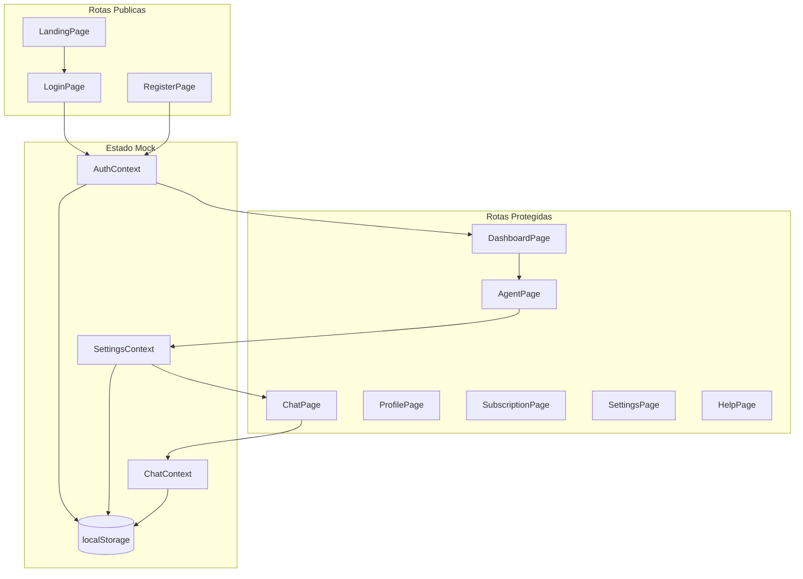

# Planejamento Completo — Plataforma SaaS de Automações e Assistentes

**Nome provisório do produto:** FlowAssist (substituível; o cliente final nunca vê terminologia de "agente de IA")

**Stack obrigatória:** React · TypeScript · Shadcn/UI · TailwindCSS · React Router · Lucide Icons

**Escopo MVP:** Frontend 100% mockado, sem backend nem IA real. Objetivo: validar produto, UX e conversão.

---

## 1. Visão Geral do Produto

### Objetivo

Oferecer uma plataforma SaaS onde pequenas e médias empresas (e profissionais autônomos) configurem e utilizem automações e assistentes inteligentes — via WhatsApp e chat interno — sem complexidade técnica.

### Público-alvo


| Segmento   | Perfil                                                   | Necessidade                                             |
| ---------- | -------------------------------------------------------- | ------------------------------------------------------- |
| Primário   | Donos de negócios locais (clínicas, lojas, consultorias) | Atender clientes 24/7 no WhatsApp sem contratar equipe  |
| Secundário | Profissionais autônomos                                  | Assistente pessoal para organização e respostas rápidas |
| Terciário  | Pequenas equipes comerciais                              | Centralizar atendimento e padronizar respostas          |


### Problema resolvido

- Atendimento manual consome tempo e gera inconsistência
- Ferramentas de IA existentes são técnicas demais para o usuário final
- WhatsApp é o canal principal no Brasil, mas integrar é complexo

### Diferenciais (posicionamento para o cliente)

- **Simplicidade:** configuração em minutos, sem código
- **Canal nativo:** WhatsApp + chat interno no mesmo lugar
- **Experiência premium:** interface moderna, inspirada nos melhores produtos SaaS
- **Tudo em um lugar:** dashboard, configuração, chat e assinatura unificados

### Proposta de valor (copy da Landing)

> "Automatize seu atendimento e tenha um assistente inteligente trabalhando por você — no WhatsApp e no seu painel."

---

## 2. Mapa Completo de Navegação (Sitemap)

```
/  (Landing Page — pública)
├── /login
├── /cadastro
├── /recuperar-senha          [MVP: tela estática/mock, sem envio real]
│
└── /app  (área logada — prefixo sugerido para rotas protegidas)
    ├── /app/dashboard
    ├── /app/meu-agente
    │   └── (sub-seções via tabs ou scroll: WhatsApp | Uso Pessoal)
    ├── /app/chat               [visível no sidebar apenas se Uso Pessoal = ativo]
    │   └── /app/chat/:conversationId
    ├── /app/configuracoes
    ├── /app/perfil
    ├── /app/assinatura
    └── /app/ajuda
```

### Hierarquia de rotas (React Router)


| Rota               | Layout         | Auth       | Descrição          |
| ------------------ | -------------- | ---------- | ------------------ |
| `/`                | `PublicLayout` | Não        | Landing page       |
| `/login`           | `AuthLayout`   | Não        | Login              |
| `/cadastro`        | `AuthLayout`   | Não        | Cadastro           |
| `/recuperar-senha` | `AuthLayout`   | Não        | Recuperação (mock) |
| `/app/*`           | `AppLayout`    | Sim (mock) | Área logada        |


### Sidebar dinâmica (área logada)

Itens fixos:

- Dashboard → `/app/dashboard`
- Meu Agente → `/app/meu-agente`
- Configurações → `/app/configuracoes`
- Perfil → `/app/perfil`
- Assinatura → `/app/assinatura`
- Ajuda → `/app/ajuda`

Item condicional:

- **Chat** → `/app/chat` — aparece somente quando `settings.personalUse.enabled === true`

### Breadcrumbs (rotas internas)

- Meu Agente > WhatsApp
- Meu Agente > Uso Pessoal
- Chat > [Nome da conversa]
- Configurações > [Seção ativa]

---

## 3. Fluxos de Usuário

### 3.1 Primeiro acesso (visitante)

```mermaid
flowchart LR
    Landing[Landing Page] --> CTA{CTA clicado}
    CTA -->|Cadastrar| Cadastro[/cadastro]
    CTA -->|Entrar| Login[/login]
    Cadastro --> Dashboard[/app/dashboard]
    Login --> Dashboard
```


**Passos:**

1. Visitante acessa `/`
2. Explora Hero, Benefícios, Como funciona, Demo, FAQ
3. Clica em "Começar grátis" ou "Entrar"
4. Completa cadastro ou login (mock)
5. Redirecionado para `/app/dashboard` com onboarding sutil (tooltip ou banner de boas-vindas)

---

### 3.2 Cadastro

```mermaid
flowchart TD
    Start[Formulário cadastro] --> Validate{Validação client-side}
    Validate -->|Erro| ShowErrors[Exibir erros inline]
    ShowErrors --> Start
    Validate -->|OK| MockCreate[Mock: criar usuário em memória/localStorage]
    MockCreate --> AutoLogin[Mock: autenticar]
    AutoLogin --> Redirect[/app/dashboard]
```


**Validações:**

- Nome: mínimo 2 caracteres
- Email: formato válido
- Senha: mínimo 8 caracteres
- Confirmar senha: deve coincidir

**Feedback:** toast de sucesso "Conta criada com sucesso!"

---

### 3.3 Login

```mermaid
flowchart TD
    Start[Formulário login] --> Validate{Campos preenchidos?}
    Validate -->|Não| Errors[Erros inline]
    Validate -->|Sim| MockAuth[Mock: aceitar credenciais demo]
    MockAuth -->|Sucesso| Dashboard[/app/dashboard]
    MockAuth -->|Falha| ToastError[Toast: credenciais inválidas]
```


**Credenciais demo sugeridas (documentar no README futuro):**

- `demo@flowassist.com` / `demo1234`

**Link:** "Esqueci minha senha" → `/recuperar-senha` (tela mock com mensagem "Enviamos um link para seu email")

---

### 3.4 Ativação do WhatsApp

```mermaid
flowchart TD
    MeuAgente[/app/meu-agente] --> ToggleWhatsApp[Toggle WhatsApp ON]
    ToggleWhatsApp --> ShowPanel[Exibir painel de conexão]
    ShowPanel --> MockConnect[Estado: conectando...]
    MockConnect --> Connected[Status: Conectado]
    Connected --> Reconnect{Reconectar?}
    Reconnect -->|Sim| MockConnect
    ToggleWhatsApp2[Toggle OFF] --> HidePanel[Ocultar painel / status desconectado]
```


**Estados da conexão (mock):**

- `disconnected` — toggle off
- `connecting` — spinner 1,5s ao ativar
- `connected` — número mock exibido, badge verde
- `reconnecting` — ao clicar "Reconectar"

---

### 3.5 Ativação do Chat (Uso Pessoal)

```mermaid
flowchart TD
    MeuAgente[/app/meu-agente] --> TogglePersonal[Toggle Uso Pessoal ON]
    TogglePersonal --> SidebarUpdate[Item Chat aparece na sidebar]
    SidebarUpdate --> ChatLink[Link "Abrir chat" na seção]
    ChatLink --> Chat[/app/chat]
    ToggleOff[Toggle OFF] --> HideChat[Item Chat some da sidebar]
    HideChat --> RedirectDash[Se em /app/chat, redirecionar para /app/meu-agente]
```


---

### 3.6 Uso do Chat

```mermaid
flowchart TD
    ChatList[/app/chat] --> SelectConv[Selecionar conversa na sidebar]
    SelectConv --> ChatView[/app/chat/:id]
    ChatView --> TypeMsg[Digitar mensagem]
    TypeMsg --> Send[Enviar]
    Send --> MockReply[Mock: resposta automática após 1-2s]
    MockReply --> UpdateUI[Atualizar thread]
    NewConv[Nova conversa] --> EmptyState[Estado vazio elegante]
    EmptyState --> FirstMsg[Primeira mensagem cria conversa mock]
```


**Comportamento mock de resposta:**

- Delay simulado (1–2s) com indicador "digitando..."
- Respostas pré-definidas em array rotativo ou por keyword simples

---

### 3.7 Atualização de Perfil

```mermaid
flowchart TD
    Perfil[/app/perfil] --> Edit[Editar nome / upload foto mock]
    Edit --> Save[Salvar]
    Save --> UpdateContext[Atualizar AuthContext + localStorage]
    UpdateContext --> Toast[Toast: Perfil atualizado]
```


---

### 3.8 Gestão de Assinatura (mock)

```mermaid
flowchart TD
    Assinatura[/app/assinatura] --> ViewPlan[Ver plano atual]
    ViewPlan --> Upgrade{Upgrade?}
    Upgrade -->|Sim| ModalPlan[Modal com planos]
    ModalPlan --> MockCheckout[Mock: confirmar]
    MockCheckout --> UpdatePlan[Atualizar plano mock]
```


---

### 3.9 Logout

- Ação no menu do usuário (header ou footer da sidebar)
- Limpa sessão mock → redirect `/login`

---

## 4. Planejamento de UX/UI

### 4.1 Princípios de UX


| Princípio         | Aplicação                                                              |
| ----------------- | ---------------------------------------------------------------------- |
| Clareza           | Linguagem do cliente ("Meu Assistente", nunca "agente de IA" ou "LLM") |
| Progressão        | Dashboard orienta próximos passos (checklist de ativação)              |
| Feedback imediato | Toasts, skeletons, estados de loading em toggles e chat                |
| Consistência      | Mesmos padrões de formulário, cards e navegação em todas as telas      |
| Confiança         | Status visuais claros (WhatsApp conectado, plano ativo)                |


### 4.2 Layout por contexto

#### Landing Page (`PublicLayout`)

- Header fixo: logo, links âncora (Benefícios, Como funciona, FAQ), CTAs Login/Cadastro
- Seções full-width empilhadas verticalmente
- Footer com links legais e contato

#### Auth (`AuthLayout`)

- Split screen desktop: 50% branding/ilustração | 50% formulário
- Mobile: formulário centralizado, branding compacto no topo
- Card centralizado max-width 400px

#### App logada (`AppLayout`)

- **Desktop:** Sidebar fixa 260px à esquerda + área de conteúdo + header opcional
- **Mobile:** Sidebar colapsável (Sheet/Drawer do Shadcn) + bottom nav opcional para itens principais
- Conteúdo: padding 24–32px, max-width 1200px (exceto Chat: full-width)

#### Chat (`ChatLayout` — variante de AppLayout)

- Três colunas desktop: sidebar app (estreita ou ocultável) | lista de conversas 280px | área de mensagens flex
- Mobile: lista de conversas OU thread (navegação por stack)
- Input fixo no rodapé com `position: sticky` ou layout flex column

### 4.3 Hierarquia visual

1. **Primário:** CTAs, título da página, status de conexão
2. **Secundário:** Descrições, labels de formulário, metadados de conversa
3. **Terciário:** Timestamps, hints, footer de seção

**Tipografia de página:**

- H1: título da rota (ex: "Meu Agente") — 1 por página
- H2: seções dentro da página (ex: "WhatsApp", "Uso Pessoal")
- Body: 14–16px para conteúdo

### 4.4 Responsividade


| Breakpoint        | Comportamento                                    |
| ----------------- | ------------------------------------------------ |
| `< 640px` (sm)    | Sidebar → Sheet; Chat single-pane; Landing stack |
| `640–1024px` (md) | Sidebar colapsada por padrão; grids 1–2 colunas  |
| `> 1024px` (lg)   | Layout completo; Chat 3 colunas; Auth split      |


### 4.5 Estados de interface

Cada tela deve prever:

- **Loading:** skeleton screens (Shadcn Skeleton)
- **Empty:** ilustração leve + copy + CTA (ex: "Nenhuma conversa ainda")
- **Error:** Alert destructive + ação de retry
- **Success:** toast + atualização visual

### 4.6 Onboarding (MVP leve)

Banner no Dashboard com checklist:

- Conectar WhatsApp
- Ativar uso pessoal
- Enviar primeira mensagem no chat

Progresso salvo em mock state/localStorage.

### 4.7 Microinterações

- Toggle: animação suave (transition)
- Envio de mensagem: fade-in da bubble
- Sidebar item ativo: highlight + borda lateral
- Hover em cards: elevação sutil (`shadow-md`)

---

## 5. Design System

### 5.1 Referências visuais


| Referência | O que absorver                                            |
| ---------- | --------------------------------------------------------- |
| ChatGPT    | Layout de chat, sidebar de conversas, input fixo, bubbles |
| Linear     | Densidade, tipografia, sidebar minimalista, dark mode     |
| Vercel     | Landing clean, gradientes sutis, hero impactante          |
| Stripe     | Cards de pricing, hierarquia de informação, confiança     |
| Shadcn/UI  | Componentes base, tokens CSS, acessibilidade              |


### 5.2 Paleta de cores

**Tema claro (default)**


| Token                  | HSL sugerido | Uso                                                             |
| ---------------------- | ------------ | --------------------------------------------------------------- |
| `--background`         | 0 0% 100%    | Fundo principal                                                 |
| `--foreground`         | 240 10% 4%   | Texto principal                                                 |
| `--primary`            | 262 83% 58%  | CTAs, links, item ativo (violeta — diferencia de ChatGPT verde) |
| `--primary-foreground` | 0 0% 100%    | Texto sobre primary                                             |
| `--secondary`          | 240 5% 96%   | Backgrounds secundários                                         |
| `--muted`              | 240 5% 96%   | Áreas muted                                                     |
| `--muted-foreground`   | 240 4% 46%   | Texto secundário                                                |
| `--accent`             | 262 83% 96%  | Hover suave                                                     |
| `--destructive`        | 0 84% 60%    | Erros, desconectar                                              |
| `--border`             | 240 6% 90%   | Bordas                                                          |
| `--ring`               | 262 83% 58%  | Focus ring                                                      |
| `--success`            | 142 76% 36%  | WhatsApp conectado                                              |
| `--warning`            | 38 92% 50%   | Avisos                                                          |


**Tema escuro**

- Background: `240 10% 4%`
- Primary mantém violeta com ajuste de contraste
- Cards: `240 6% 10%`

**WhatsApp accent (uso pontual):** `#25D366` — apenas ícones/status WhatsApp, não como primary global.

### 5.3 Tipografia


| Nível           | Fonte               | Tamanho               | Peso |
| --------------- | ------------------- | --------------------- | ---- |
| Display (Hero)  | Inter ou Geist Sans | 48–56px / 36px mobile | 700  |
| H1              | Inter/Geist         | 30px                  | 600  |
| H2              | Inter/Geist         | 24px                  | 600  |
| H3              | Inter/Geist         | 18px                  | 600  |
| Body            | Inter/Geist         | 14–16px               | 400  |
| Small           | Inter/Geist         | 12px                  | 400  |
| Code (opcional) | Geist Mono          | 13px                  | 400  |


**Instalação:** Google Fonts ou `@fontsource/inter` — Geist se disponível via Vercel.

### 5.4 Espaçamentos

Base unit: **4px**


| Token      | Valor | Uso                      |
| ---------- | ----- | ------------------------ |
| `space-1`  | 4px   | Gaps mínimos             |
| `space-2`  | 8px   | Entre ícone e texto      |
| `space-3`  | 12px  | Padding interno compacto |
| `space-4`  | 16px  | Padding padrão           |
| `space-6`  | 24px  | Entre seções             |
| `space-8`  | 32px  | Padding de página        |
| `space-12` | 48px  | Entre blocos da landing  |
| `space-16` | 64px  | Seções hero              |


**Border radius:** `--radius: 0.5rem` (Shadcn default); cards `lg` (8px); bubbles chat `xl` (12px).

### 5.5 Componentes Shadcn/UI a instalar

**Essenciais MVP:**

- Button, Input, Label, Textarea
- Card, CardHeader, CardTitle, CardDescription, CardContent
- Switch (toggles WhatsApp / Uso Pessoal)
- Badge (status conexão, plano)
- Avatar, AvatarImage, AvatarFallback
- Separator, ScrollArea
- Sheet (sidebar mobile)
- Dialog / AlertDialog (modais upgrade, confirmar logout)
- DropdownMenu (menu usuário)
- Tabs (se Meu Agente usar tabs)
- Toast + Toaster (Sonner ou Shadcn toast)
- Skeleton
- Alert
- Tooltip
- Form (react-hook-form + zod — validação)
- Progress (limites de uso assinatura)
- Accordion (FAQ landing e ajuda)

### 5.6 Ícones (Lucide)


| Contexto        | Ícone                                                           |
| --------------- | --------------------------------------------------------------- |
| Dashboard       | `LayoutDashboard`                                               |
| Meu Agente      | `Bot` ou `Sparkles` (evitar "robô" óbvio — preferir `Sparkles`) |
| Chat            | `MessageSquare`                                                 |
| Configurações   | `Settings`                                                      |
| Perfil          | `User`                                                          |
| Assinatura      | `CreditCard`                                                    |
| Ajuda           | `HelpCircle`                                                    |
| WhatsApp        | `MessageCircle` (ou SVG custom verde)                           |
| Logout          | `LogOut`                                                        |
| Enviar mensagem | `Send`                                                          |
| Nova conversa   | `Plus`                                                          |
| Conectado       | `CheckCircle2`                                                  |
| Desconectado    | `XCircle`                                                       |
| Menu mobile     | `Menu`                                                          |


### 5.7 Estados visuais de componentes


| Componente            | Default       | Hover       | Active                       | Disabled    | Loading                   |
| --------------------- | ------------- | ----------- | ---------------------------- | ----------- | ------------------------- |
| Button primary        | bg primary    | opacity 90% | scale 98%                    | opacity 50% | spinner + "Carregando..." |
| Switch                | track muted   | —           | track primary                | opacity 50% | —                         |
| Input                 | border border | ring ring   | —                            | bg muted    | —                         |
| Sidebar item          | transparent   | bg accent   | bg accent + border-l primary | —           | —                         |
| Chat bubble user      | bg primary    | —           | —                            | —           | —                         |
| Chat bubble assistant | bg muted      | —           | —                            | —           | typing indicator          |


---

## 6. Estrutura de Componentes React

### 6.1 Layouts


| Componente     | Responsabilidade                                                          |
| -------------- | ------------------------------------------------------------------------- |
| `PublicLayout` | Header landing + footer + `<Outlet />`                                    |
| `AuthLayout`   | Split branding + card de formulário                                       |
| `AppLayout`    | Sidebar + header + `<Outlet />`; lê auth e settings para sidebar dinâmica |
| `ChatLayout`   | Extensão de AppLayout otimizada para chat full-height                     |


### 6.2 Componentes compartilhados


| Componente        | Descrição                                             |
| ----------------- | ----------------------------------------------------- |
| `AppSidebar`      | Navegação principal, logo, itens condicionais, logout |
| `AppHeader`       | Título da página, breadcrumbs, avatar/menu usuário    |
| `MobileNav`       | Sheet com navegação para mobile                       |
| `UserMenu`        | Dropdown: Perfil, Assinatura, Sair                    |
| `PageHeader`      | Título + descrição + ação opcional                    |
| `EmptyState`      | Ícone + título + descrição + CTA — reutilizável       |
| `LoadingSkeleton` | Variantes: card, list, chat                           |
| `StatusBadge`     | Conectado / Desconectado / Conectando                 |
| `ConfirmDialog`   | Confirmação genérica                                  |
| `ThemeToggle`     | Claro/escuro (opcional MVP, recomendado)              |


### 6.3 Componentes de Landing


| Componente           | Seção                                               |
| -------------------- | --------------------------------------------------- |
| `LandingHeader`      | Nav + CTAs                                          |
| `HeroSection`        | Headline, subheadline, CTA, imagem/mockup           |
| `BenefitsSection`    | Grid 3–4 cards de benefícios                        |
| `HowItWorksSection`  | Steps numerados (1-2-3)                             |
| `ProductDemoSection` | Screenshot/mockup animado do dashboard              |
| `PricingTeaser`      | Opcional: menção "planos a partir de..." → cadastro |
| `FAQSection`         | Accordion                                           |
| `LandingFooter`      | Links, copyright, redes                             |
| `CTASection`         | Banner final de conversão                           |


### 6.4 Componentes de Auth


| Componente           | Descrição                            |
| -------------------- | ------------------------------------ |
| `LoginForm`          | Email, senha, submit, link recuperar |
| `RegisterForm`       | Nome, email, senha, confirmar        |
| `ForgotPasswordForm` | Email + mock submit                  |
| `AuthBranding`       | Painel lateral com logo e depoimento |


### 6.5 Componentes de Dashboard


| Componente            | Descrição                                       |
| --------------------- | ----------------------------------------------- |
| `WelcomeBanner`       | Saudação personalizada com nome                 |
| `OnboardingChecklist` | Passos de ativação                              |
| `QuickStats`          | Cards: status WhatsApp, conversas, uso do plano |
| `RecentActivity`      | Lista mock de atividades recentes               |


### 6.6 Componentes de Meu Agente


| Componente                  | Descrição                        |
| --------------------------- | -------------------------------- |
| `AgentConfigPage`           | Container das seções             |
| `WhatsAppConfigCard`        | Toggle + painel condicional      |
| `WhatsAppConnectionPanel`   | Número, status, botão reconectar |
| `PersonalUseConfigCard`     | Toggle + link para chat          |
| `ConnectionStatusIndicator` | Badge + ícone animado            |


### 6.7 Componentes de Chat


| Componente         | Descrição                               |
| ------------------ | --------------------------------------- |
| `ChatPage`         | Layout master do chat                   |
| `ConversationList` | Sidebar com busca e lista               |
| `ConversationItem` | Preview: título, última msg, timestamp  |
| `ChatThread`       | Área de mensagens scrollável            |
| `ChatMessage`      | Bubble user/assistant com timestamp     |
| `ChatInput`        | Textarea + botão enviar, fixo no rodapé |
| `TypingIndicator`  | Três dots animados                      |
| `NewChatButton`    | Cria conversa mock                      |
| `ChatEmptyState`   | "Como posso ajudar?" centralizado       |


### 6.8 Componentes de Perfil, Assinatura, Ajuda, Configurações


| Componente            | Descrição                                       |
| --------------------- | ----------------------------------------------- |
| `ProfileForm`         | Nome, email (readonly), upload foto mock        |
| `AvatarUpload`        | Preview + botão "Alterar foto"                  |
| `SubscriptionCard`    | Plano, renovação, limites                       |
| `UsageProgress`       | Barras de uso (mensagens, conversas)            |
| `PlanComparisonModal` | Tabela de planos mock                           |
| `HelpPage`            | FAQ accordion + card contato                    |
| `SettingsPage`        | Preferências gerais (notificações mock, idioma) |


### 6.9 Componentes de formulário (padrão)

- Todos os forms usam Shadcn `Form` + `react-hook-form` + `zod`
- Erros inline abaixo do campo
- Submit desabilitado durante loading
- Campos com ícone Lucide opcional (Mail, Lock, User)

### 6.10 Providers / Contextos (sem código, apenas contrato)


| Provider           | Estado                                                        |
| ------------------ | ------------------------------------------------------------- |
| `AuthProvider`     | user, isAuthenticated, login, logout, register, updateProfile |
| `SettingsProvider` | whatsApp, personalUse, toggles, persistência localStorage     |
| `ChatProvider`     | conversations, messages, sendMessage, createConversation      |
| `ThemeProvider`    | theme light/dark                                              |


---

## 7. Estrutura de Pastas

```
src/
├── app/                          # Bootstrap da aplicação
│   ├── App.tsx                   # Router root
│   ├── providers.tsx             # Composição de providers
│   └── routes.tsx                # Definição de rotas
│
├── assets/                       # Imagens, logos, ilustrações
│   ├── logo.svg
│   └── landing/
│
├── components/
│   ├── ui/                       # Shadcn/UI (gerados via CLI)
│   ├── layouts/
│   │   ├── PublicLayout.tsx
│   │   ├── AuthLayout.tsx
│   │   ├── AppLayout.tsx
│   │   └── ChatLayout.tsx
│   ├── shared/
│   │   ├── AppSidebar.tsx
│   │   ├── AppHeader.tsx
│   │   ├── PageHeader.tsx
│   │   ├── EmptyState.tsx
│   │   ├── StatusBadge.tsx
│   │   └── ...
│   ├── landing/
│   ├── auth/
│   ├── dashboard/
│   ├── agent/
│   ├── chat/
│   ├── profile/
│   ├── subscription/
│   ├── settings/
│   └── help/
│
├── pages/                        # Páginas (1 por rota, composição de components)
│   ├── LandingPage.tsx
│   ├── LoginPage.tsx
│   ├── RegisterPage.tsx
│   ├── ForgotPasswordPage.tsx
│   ├── DashboardPage.tsx
│   ├── AgentPage.tsx
│   ├── ChatPage.tsx
│   ├── ProfilePage.tsx
│   ├── SubscriptionPage.tsx
│   ├── SettingsPage.tsx
│   └── HelpPage.tsx
│
├── hooks/
│   ├── use-auth.ts
│   ├── use-settings.ts
│   ├── use-chat.ts
│   ├── use-mobile.ts             # Shadcn pattern
│   └── use-local-storage.ts
│
├── contexts/
│   ├── auth-context.tsx
│   ├── settings-context.tsx
│   └── chat-context.tsx
│
├── lib/
│   ├── utils.ts                  # cn() helper Shadcn
│   ├── constants.ts              # Rotas, labels, credenciais demo
│   └── validators/
│       ├── auth.schema.ts        # Zod schemas
│       └── profile.schema.ts
│
├── mocks/
│   ├── users.ts
│   ├── conversations.ts
│   ├── messages.ts
│   ├── subscription.ts
│   ├── agent-settings.ts
│   └── mock-chat-responses.ts
│
├── types/
│   ├── user.ts
│   ├── conversation.ts
│   ├── message.ts
│   ├── subscription.ts
│   └── agent-settings.ts
│
├── styles/
│   └── globals.css               # Tailwind + CSS variables Shadcn
│
└── main.tsx                      # Entry point
```

### Convenções

- **Pages** = colagem de componentes, sem lógica pesada
- **Hooks/Contexts** = toda lógica mock e estado
- **Mocks** = dados estáticos + factories para gerar IDs
- **Types** = interfaces TypeScript compartilhadas
- Path alias `@/` → `src/` (configurar no tsconfig + Vite)

### Dependências previstas (referência para equipe)

- `react`, `react-dom`, `react-router-dom`
- `tailwindcss`, `class-variance-authority`, `clsx`, `tailwind-merge`
- `lucide-react`
- `react-hook-form`, `@hookform/resolvers`, `zod`
- `@radix-ui/`* (via Shadcn)
- `vite`, `typescript`, `@types/react`

---

## 8. Estados Mockados

### 8.1 Usuário (`User`)

```typescript
// Contrato TypeScript (referência, não implementar agora)
interface User {
  id: string
  name: string
  email: string
  avatarUrl?: string
  createdAt: string
}
```

**Usuário demo default:**

- id: `"user-001"`
- name: `"Maria Silva"`
- email: `"demo@flowassist.com"`
- avatarUrl: placeholder (UI Avatars ou DiceBear)
- createdAt: `"2025-01-15T10:00:00Z"`

**Usuário pós-cadastro:** gerar id UUID mock, name/email do form.

---

### 8.2 Configurações do Agente (`AgentSettings`)

```typescript
interface AgentSettings {
  whatsapp: {
    enabled: boolean
    phoneNumber?: string        // ex: "+55 11 98765-4321"
    connectionStatus: 'disconnected' | 'connecting' | 'connected' | 'reconnecting'
    connectedAt?: string
  }
  personalUse: {
    enabled: boolean
  }
}
```

**Estado inicial (novo usuário):**

- whatsapp.enabled: `false`, status: `disconnected`
- personalUse.enabled: `false`

**Estado demo (usuário demo logado):**

- whatsapp.enabled: `true`, phone: `"+55 11 98765-4321"`, status: `connected`
- personalUse.enabled: `true`

**Persistência:** `localStorage` key `flowassist_settings`

---

### 8.3 Conversas (`Conversation[]`)

```typescript
interface Conversation {
  id: string
  title: string
  lastMessage: string
  lastMessageAt: string
  messageCount: number
}
```

**Conversas mock pré-carregadas (3–5):**


| id       | title                      | lastMessage                       | lastMessageAt        |
| -------- | -------------------------- | --------------------------------- | -------------------- |
| conv-001 | Ideias para post Instagram | Claro! Aqui estão 3 ideias...     | 2025-06-18T14:30:00Z |
| conv-002 | Rascunho de email cliente  | Segue o rascunho revisado...      | 2025-06-17T09:15:00Z |
| conv-003 | Resumo da reunião          | Os principais pontos foram...     | 2025-06-15T16:45:00Z |
| conv-004 | Roteiro de vendas          | Para abordagem inicial, sugiro... | 2025-06-14T11:00:00Z |


---

### 8.4 Mensagens (`Message[]`)

```typescript
interface Message {
  id: string
  conversationId: string
  role: 'user' | 'assistant'
  content: string
  createdAt: string
}
```

**Por conversa:** 4–8 mensagens alternando user/assistant.

**Exemplo conv-001:**

1. user: "Preciso de ideias para post no Instagram sobre promoção de verão"
2. assistant: "Claro! Aqui estão 3 ideias criativas para sua promoção de verão..."
3. user: "Gostei da segunda, pode expandir?"
4. assistant: "Perfeito! A ideia do 'Verão Premium' inclui..."

**Respostas automáticas mock (rotativo):**

- "Entendi! Posso ajudar com isso. Deixe-me elaborar..."
- "Ótima pergunta! Aqui está o que eu sugiro..."
- "Claro! Baseado no que você descreveu..."
- "Vou preparar isso para você. Um momento..."

**Delay:** `setTimeout` 1000–2000ms + `TypingIndicator`

---

### 8.5 Assinatura (`Subscription`)

```typescript
interface Subscription {
  plan: 'free' | 'starter' | 'pro' | 'business'
  planName: string
  price: number
  currency: 'BRL'
  renewalDate: string
  status: 'active' | 'past_due' | 'canceled'
  limits: {
    whatsappMessages: { used: number; max: number }
    chatMessages: { used: number; max: number }
    conversations: { used: number; max: number }
  }
}
```

**Plano demo (starter):**

- planName: `"Starter"`
- price: `97`
- renewalDate: `"2025-07-18"`
- status: `active`
- limits: whatsapp 450/1000, chat 120/500, conversations 8/50

**Planos para modal de upgrade:**


| Plano    | Preço/mês | WhatsApp  | Chat      | Conversas |
| -------- | --------- | --------- | --------- | --------- |
| Free     | R$ 0      | 100       | 50        | 5         |
| Starter  | R$ 97     | 1.000     | 500       | 50        |
| Pro      | R$ 197    | 5.000     | 2.000     | 200       |
| Business | R$ 497    | Ilimitado | Ilimitado | Ilimitado |


---

### 8.6 Dashboard — Atividades recentes

```typescript
interface Activity {
  id: string
  type: 'whatsapp' | 'chat' | 'config'
  description: string
  timestamp: string
}
```

**Exemplos:**

- "WhatsApp conectado com sucesso" — 2025-06-18T10:00:00Z
- "Nova conversa iniciada no chat" — 2025-06-18T14:30:00Z
- "Uso pessoal ativado" — 2025-06-17T08:00:00Z

---

### 8.7 FAQ (Landing + Ajuda)

**8–10 perguntas**, ex:

1. O que é o FlowAssist?
2. Preciso de conhecimento técnico?
3. Como funciona a conexão com WhatsApp?
4. Posso usar só o chat interno?
5. Quais planos estão disponíveis?
6. Posso cancelar a qualquer momento?
7. Meus dados estão seguros?
8. Como falar com suporte?

---

### 8.8 Contato / Suporte (mock)

- Email: `suporte@flowassist.com`
- Horário: Seg–Sex, 9h–18h
- Botão "Enviar mensagem" → toast "Mensagem enviada! Retornaremos em breve."

---

## 9. Roadmap Futuro

### Fase 2 — Backend e Auth real

- API REST ou tRPC + PostgreSQL
- Auth com JWT / session cookies
- Recuperação de senha real (email transacional)
- Rate limiting

### Fase 3 — Integração WhatsApp

- WhatsApp Business API (Meta Cloud API)
- Fluxo OAuth de conexão
- Webhook de mensagens recebidas
- Envio real de respostas

### Fase 4 — IA real

- Integração LLM (OpenAI, Anthropic ou modelo self-hosted)
- System prompt configurável por cliente
- RAG com base de conhecimento (upload PDF, URLs)
- Histórico persistente com context window

### Fase 5 — Múltiplos agentes

- Criar vários assistentes com personalidades distintas
- Atribuição por canal (WhatsApp A → Agente X)
- Templates de agente por segmento (clínica, e-commerce)

### Fase 6 — Equipes

- Multi-usuário por conta
- Roles: admin, editor, viewer
- Convite por email
- Log de auditoria

### Fase 7 — Analytics

- Dashboard de métricas: mensagens, tempo de resposta, satisfação
- Export CSV
- Gráficos de uso ao longo do tempo

### Fase 8 — Integrações

- CRM (HubSpot, Pipedrive)
- Calendário (Google Calendar)
- E-commerce (Shopify, WooCommerce)
- Webhooks e API pública
- Zapier/Make

### Fase 9 — Monetização avançada

- Billing real (Stripe)
- Faturas, notas fiscais
- Trial 14 dias
- Upsell in-app

---

## Diagrama de arquitetura frontend (MVP)




---

## Critérios de aceite do MVP (para equipe)

1. Todas as rotas do sitemap navegáveis
2. Login/cadastro mock funcional com persistência de sessão
3. Toggles WhatsApp e Uso Pessoal alteram UI e persistem
4. Chat envia mensagem e recebe resposta mock com typing indicator
5. Sidebar dinâmica: Chat só aparece com Uso Pesso
6. Landing page completa com todas as seções
7. Responsivo em mobile, tablet e desktop
8. Tema claro/escuro (recomendado)
9. Estados empty, loading e error em telas principais
10. Zero dependência de backend

---

## Ordem de implementação sugerida

1. Setup projeto (Vite + React + TS + Tailwind + Shadcn)
2. Design tokens + layouts base
3. Auth mock + rotas protegidas
4. AppLayout + Sidebar
5. Dashboard
6. Meu Agente (toggles + estados)
7. Chat completo
8. Perfil, Assinatura, Configurações, Ajuda
9. Landing page
10. Polish: responsividade, toasts, skeletons, empty states

