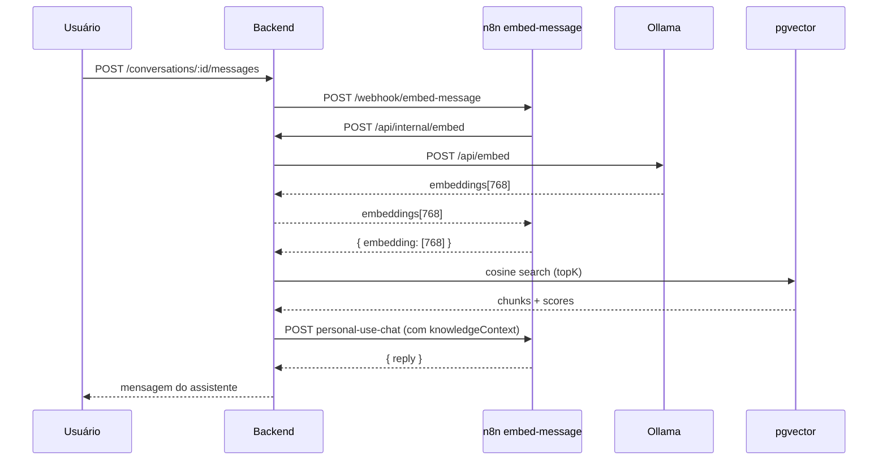

# Workflow 1 — Embed Message (RAG query)

> Status: **concluído** (Ollama `nomic-embed-text`, 768d)  
> Path do webhook: `embed-message`  
> Última atualização: junho/2026

---

## Visão geral

Este workflow gera o **embedding da pergunta do usuário** a cada mensagem no chat interno.
O backend usa o vetor para busca semântica no pgvector (`searchByAgent()`).

**Responsabilidades do n8n:**

- Receber a pergunta do backend (webhook síncrono)
- Validar `x-webhook-secret`
- Chamar o proxy `POST /api/internal/embed` → Ollama local
- Retornar `{ embedding: [768 floats] }`

**O que o n8n não faz:**

- Buscar chunks no banco (feito pelo backend após receber o embedding)
- Indexar arquivos (workflow separado: `knowledge-file-processing`)
- Gerar resposta do LLM (workflow separado: `personal-use-chat`)

---

## Arquitetura

```
Usuário envia mensagem no chat
  → Backend sendMessage()
  → searchByAgent() → embedText()
  → POST {N8N_URL}/embed-message
  → [Este workflow]
  → POST {API_URL}/api/internal/embed → Ollama
  → { embedding: [768] }
  → Backend: pgvector cosine search
  → knowledgeContext no personal-use-chat
```

### Direção das chamadas

| De → Para | Protocolo |
| --- | --- |
| Backend → n8n | `POST {N8N_URL}/embed-message` (síncrono) |
| n8n → Backend | `POST {API_URL}/api/internal/embed` |
| Backend → Ollama | `POST localhost:11434/api/embed` (interno) |

O proxy Ollama e o ngrok são os mesmos do file processor.  
Detalhes: [`documentation/n8n/ollama-proxy-embeddings.md`](../ollama-proxy-embeddings.md)

---

## Pré-requisitos

### Backend `.env`

```env
MOCK_RAG=false
N8N_URL="https://<instancia>.app.n8n.cloud/webhook"
N8N_WEBHOOK_SECRET="..."
EMBEDDING_MODEL="nomic-embed-text"
EMBEDDING_DIMENSIONS=768
VECTOR_SEARCH_MIN_SCORE=0.5
OLLAMA_URL="http://localhost:11434"
```

### Ollama + ngrok

```bash
cd backend
npm run ollama:setup
npm run dev
ngrok http 3000    # API_URL no n8n
```

### Variáveis no n8n (Settings → Variables)

| Variável | Uso |
| --- | --- |
| `API_URL` | URL pública do backend (ngrok porta 3000) |
| `N8N_WEBHOOK_SECRET` | Header `x-webhook-secret` (backend↔n8n) |
| `EMBEDDING_MODEL` | `nomic-embed-text` (opcional; fallback no node) |

### Dependências

- WF **#2** `knowledge-file-processing` concluído com `vectors > 0` (chunks indexados)
- Workflow **Active** (usar `/webhook`, não `/webhook-test`)

---

## Fluxo de nodes

```
Webhook → validar secret → IF → HTTP proxy embed → extrair → Respond 200
                          └→ Respond 401
```

---

## Node 1 — Webhook

| Parâmetro | Valor |
| --- | --- |
| HTTP Method | POST |
| Path | `embed-message` |
| Authentication | None |
| Response Mode | **Using 'Respond to Webhook' Node** |

URL produção: `{N8N_URL}/embed-message`

---

## Node 2 — Code `validar secret`

Mode: **Run Once for All Items**

```javascript
const item = $input.first().json;
const headers = item.headers || {};
const secret = headers['x-webhook-secret'] || headers['X-Webhook-Secret'];
const expected = $vars.N8N_WEBHOOK_SECRET;

if (secret !== expected) {
  return [{ json: { unauthorized: true } }];
}

const body = item.body ?? item;
return [{ json: { unauthorized: false, ...body } }];
```

---

## Node 3 — IF `autorizado?`

| Ramo | Condição | Destino |
| --- | --- | --- |
| True | `unauthorized` is true | Respond 401 |
| False | | HTTP proxy embed |

---

## Node 4 — Respond to Webhook `401`

| Parâmetro | Valor |
| --- | --- |
| Respond With | JSON |
| Response Body | `{ "error": "Unauthorized" }` |
| Response Code | 401 |

---

## Node 5 — HTTP Request `proxy embed`

| Parâmetro | Valor |
| --- | --- |
| Method | POST |
| URL | `={{ ($vars.API_URL).replace(/\/$/, '') + '/api/internal/embed' }}` |
| Header | `Content-Type: application/json` |
| Header | `x-webhook-secret: {{ $vars.N8N_WEBHOOK_SECRET }}` |
| Send Body | JSON |
| Options → Never Error | true |
| Timeout | 120000 (recomendado) |

**JSON Body** (modo Expression `fx`):

```javascript
={{ JSON.stringify({
  model: $json.model || $vars.EMBEDDING_MODEL || 'nomic-embed-text',
  input: $json.text
}) }}
```

> Use `JSON.stringify` em expressão — texto com newlines quebra JSON estático.

**Payload enviado pelo backend** (`embedding.client.ts`):

```json
{
  "text": "o que vocês possuem nos registros?",
  "model": "nomic-embed-text",
  "dimensions": 768
}
```

---

## Node 6 — Code `extrair embedding`

```javascript
let embedding = [];
try {
  const raw = $input.first().json;
  embedding = raw.embeddings?.[0] ?? raw.embedding ?? [];
} catch {}

if (!embedding.length) {
  throw new Error('Ollama nao retornou embedding');
}

return [{ json: { embedding } }];
```

Resposta Ollama via proxy: `embeddings[0]` (768 floats).

---

## Node 7 — Respond to Webhook `200`

| Parâmetro | Valor |
| --- | --- |
| Respond With | JSON |
| Response Body | `={{ $json }}` (modo Expression) |
| Response Code | 200 |

**Contrato obrigatório:**

```json
{
  "embedding": [0.012, -0.034, "... 768 floats ..."]
}
```

---

## Integração no backend

| Arquivo | Função |
| --- | --- |
| `embedding.client.ts` | `embedText()` → chama webhook `embed-message` |
| `knowledge.service.ts` | `searchByAgentVector()` → usa embedding + pgvector |
| `chat.service.ts` | `sendMessage()` → RAG antes do LLM |
| `internal.routes.ts` | `POST /api/internal/embed` → proxy Ollama |

### Logs esperados (chat com RAG)

```
INFO [embedding] Gerando embedding via N8N { path: 'embed-message', ... }
INFO [n8n] Webhook embed-message OK { durationMs: ... }
INFO [knowledge] Busca vetorial retornou hits { hits: 2, topScore: 0.572 }
INFO [chat] RAG concluido { hits: 2, contextChars: 3507, scores: [...] }
INFO [llm] Gerando resposta via N8N personal-use-chat { knowledgeContextChars: 3507 }
```

---

## Busca após o embed

O backend filtra hits com `score >= VECTOR_SEARCH_MIN_SCORE` (default `0.5`).
Se nenhum chunk passar no corte, tenta fallback por palavras-chave (termos com ≥ 3 caracteres).

| Query | Comportamento típico |
| --- | --- |
| `"ghg"` | Hit vetorial (~0.57) — acrônimo alinhado ao conteúdo |
| `"gh"` | Sem hit — score vetorial abaixo de 0.5; keyword ignora termos < 3 chars |
| `"ola fulano"` | Sem hit — cumprimento sem relação semântica com a base |

---

## Teste manual

```bash
curl -X POST "https://SEU-N8N.app.n8n.cloud/webhook/embed-message" \
  -H "Content-Type: application/json" \
  -H "x-webhook-secret: SEU_N8N_WEBHOOK_SECRET" \
  -d '{"text":"teste ghg protocol","model":"nomic-embed-text","dimensions":768}'
```

Resposta esperada: JSON com `embedding` array de **768** números.

### Teste end-to-end (chat)

1. Arquivo na base com status `ready` e `vectors > 0`
2. `MOCK_RAG=false`, `MOCK_AI=false`
3. Enviar pergunta sobre o conteúdo da planilha no chat
4. Verificar logs: `knowledgeContextChars > 0`

---

## Troubleshooting

| Erro | Causa | Solução |
| --- | --- | --- |
| 403 / Unauthorized | Secret divergente | Igualar `N8N_WEBHOOK_SECRET` backend e n8n |
| 404 no webhook | Workflow inativo ou `/webhook-test` | Active + `N8N_URL=/webhook` |
| Body vazio no backend | Respond sem JSON | Response Body `={{ $json }}` em Expression |
| 502 Ollama indisponível | Docker parado | `npm run ollama:setup` |
| 404 no `/api/internal/embed` | ngrok na porta errada | Só `ngrok http 3000` |
| RAG com 0 hits (pipeline OK) | Query curta ou score < 0.5 | Pergunta mais específica; ou baixar `VECTOR_SEARCH_MIN_SCORE` |
| Dimensão errada | Modelo diferente do indexado | `nomic-embed-text` + 768 em todo o stack |

---

## Checklist go-live

- [x] Workflow **Active** no n8n
- [x] `MOCK_RAG=false` no backend
- [x] Ollama local + `nomic-embed-text`
- [x] `API_URL` = ngrok porta 3000
- [x] `N8N_WEBHOOK_SECRET` igual nos dois lados
- [x] curl retorna `{ embedding: [768 floats] }`
- [x] Chat com pergunta sobre a base → `hits > 0` nos logs

---

## Diagrama



---

## Referências cruzadas

- File processor (indexação): [`documentation/n8n/concluded/file-processor.md`](file-processor.md)
- Proxy Ollama + ngrok: [`documentation/n8n/ollama-proxy-embeddings.md`](../ollama-proxy-embeddings.md)
- Integração geral: [`documentation/BACKEND-INTEGRACAO.md`](../../BACKEND-INTEGRACAO.md) (seções 4, 6.3, 7.1)
- Spec de implementação: [`to-implement/01-embed-message.md`](../../../to-implement/01-embed-message.md)
- Backend: `embedding.client.ts`, `knowledge.service.ts`, `chat.service.ts`
