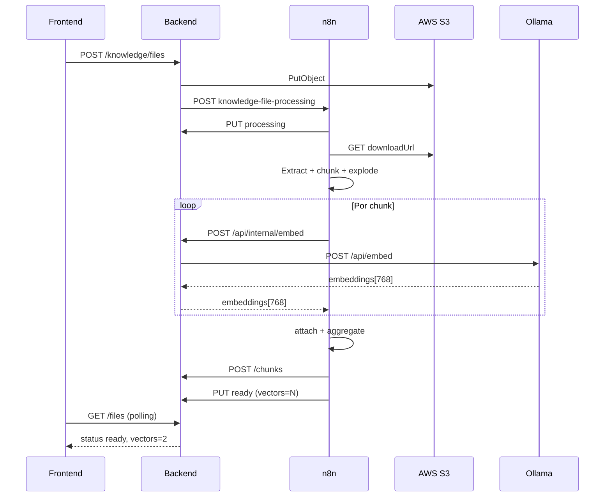

# Workflow 07 — File Processor (RAG + Embeddings)

> Status: **concluído** (CSV/XLSX + embeddings Ollama 768d)  
> Path do webhook: `knowledge-file-processing`  
> Última atualização: junho/2026

---

## Visão geral

Este workflow processa arquivos da Base de Conhecimento (CSV e XLSX) após upload no frontend,
gera **embeddings** por chunk e persiste vetores no PostgreSQL (pgvector).

**Responsabilidades do n8n:**

- Baixar arquivo do S3 (URL assinada)
- Extrair conteúdo (1 aba no xlsx)
- Transformar em chunks de texto
- **Embeddar cada chunk** via proxy do backend → Ollama local
- Salvar chunks + vetores no backend
- Atualizar status do arquivo para `ready` com `vectors > 0`

**O que o n8n não faz:**

- Multi-aba em xlsx
- Upload para S3 (feito pelo backend)
- Embed da pergunta do chat (workflow separado: `embed-message`)

---

## Arquitetura

```
Frontend upload
  → Backend salva S3 + cria registro (status: uploading)
  → Backend dispara n8n (MOCK_RAG=false)
  → [Este workflow]
  → POST /api/internal/embed (por chunk) → Ollama nomic-embed-text
  → POST /chunks (content + embedding 768d)
  → PUT status ready (vectors = N)
  → Frontend polling até ready
```

### Embeddings e ngrok

O N8N Cloud não alcança `localhost:11434`. O backend expõe **`POST /api/internal/embed`**
(protegido por `x-webhook-secret`) e repassa ao Ollama no Docker.

```
N8N Cloud → ngrok:3000 → Backend → localhost:11434 → Ollama
            /api/internal/embed
            /api/knowledge/...        (callbacks)
```

**Um único túnel ngrok** na porta 3000 serve callbacks e embeddings.  
Detalhes: [`documentation/n8n/ollama-proxy-embeddings.md`](../ollama-proxy-embeddings.md)

### Direção das chamadas

| De → Para | Protocolo |
| --- | --- |
| Backend → n8n | `POST {N8N_URL}/knowledge-file-processing` |
| n8n → Backend | `PUT/POST {API_URL}/api/knowledge/...` |
| n8n → Backend (embed) | `POST {API_URL}/api/internal/embed` |
| Backend → Ollama | `POST localhost:11434/api/embed` (interno) |

---

## Pré-requisitos

### Backend `.env`

```env
MOCK_RAG=false
N8N_URL="https://<instancia>.app.n8n.cloud/webhook"   # produção (não webhook-test)
N8N_WEBHOOK_SECRET="..."
EMBEDDING_MODEL="nomic-embed-text"
EMBEDDING_DIMENSIONS=768
OLLAMA_URL="http://localhost:11434"
```

### Ollama local

```bash
cd backend
npm run ollama:setup    # docker + pull nomic-embed-text
npm run dev
ngrok http 3000         # API_URL no n8n
```

### Variáveis no n8n (Settings → Variables)

| Variável | Uso |
| --- | --- |
| `API_URL` | URL pública do backend (ngrok porta 3000) |
| `N8N_WEBHOOK_SECRET` | Header `x-webhook-secret` em todas as chamadas (backend↔n8n) |
| `EMBEDDING_MODEL` | `nomic-embed-text` (opcional; fallback no node) |

> Não use variável `OLLAMA_URL` no n8n — embeddings passam pelo proxy `/api/internal/embed`.

### Formato de arquivo aceito

- `.csv` (delimiter `;` recomendado para PT-BR)
- `.xlsx` (apenas **primeira aba**)

---

## Trigger — Webhook

| Campo | Valor |
| --- | --- |
| Method | POST |
| Path | `knowledge-file-processing` |
| Response | Immediately (fire-and-forget) |

### Payload enviado pelo backend

```json
{
  "fileId": "uuid",
  "agentId": "uuid",
  "storageUrl": "s3://{userId}/arquivo.xlsx",
  "downloadUrl": "https://bucket.s3.amazonaws.com/...?X-Amz-Signature=...",
  "fileType": "csv | xlsx",
  "embeddingModel": "nomic-embed-text",
  "embeddingDimensions": 768
}
```

- `downloadUrl`: URL assinada (~1h) — usada para download no n8n
- **Não é necessária credencial AWS no n8n**

### Autenticação (entrada)

Validar header `x-webhook-secret` = `N8N_WEBHOOK_SECRET`.

---

## Fluxo de nodes (ordem completa)

```
 1. Webhook
 2. HTTP PUT → status processing (progress 0)
 3. HTTP GET → downloadUrl (binary)
 4. Switch → csv | xlsx
 5. Extract from File
 6. Code → map chunks
 7. HTTP PUT → progress 45%
 8. Code → explode chunks
 9. HTTP → ollama embed chunk (POST /api/internal/embed, por item)
10. Code → attach embedding
11. Code → aggregate chunks
12. HTTP POST → /chunks
13. HTTP PUT → status ready
```

---

## Node a node

### 1–7. Extração e chunking

Nodes 1–7 inalterados em relação ao MVP: webhook, callback 0%, get file, switch,
extract csv/xlsx, **map chunks**, callback 45%.

Ver código do **map chunks** abaixo (seção 6).

---

### 8. Code — `explode chunks`

**Conecta:** `callback 45%` → `explode chunks`  
**Mode:** Run Once for All Items

```javascript
const { fileId, chunks } = $('map chunks').first().json;

if (!chunks?.length) {
  throw new Error('Nenhum chunk para embeddar');
}

return chunks.map((c) => ({
  json: {
    fileId,
    content: c.content,
    chunkIndex: c.chunkIndex,
  },
}));
```

**Saída:** N items (1 por chunk).

---

### 9. HTTP Request — `ollama embed chunk`

**Conecta:** `explode chunks` → `ollama embed chunk`

| Campo | Valor |
| --- | --- |
| Method | POST |
| URL | `={{ ($vars.API_URL).replace(/\/$/, '') + '/api/internal/embed' }}` |
| Header | `Content-Type: application/json` |
| Header | `x-webhook-secret: {{ $vars.N8N_WEBHOOK_SECRET }}` |
| Header | `ngrok-skip-browser-warning: true` (se ngrok free) |
| Body (expressão `fx`) | ver abaixo |
| Options → Timeout | `120000` ms ou mais (embed ~15s/chunk em CPU) |
| Options → Never Error | true (opcional) |

**Body** — campo inteiro em modo Expression:

```javascript
{{ JSON.stringify({
  model: $vars.EMBEDDING_MODEL || 'nomic-embed-text',
  input: $('explode chunks').item.json.content
}) }}
```

> Não use JSON estático com `"input": "={{ ... }}"` — chunks com newline quebram o parser.
> Use `JSON.stringify` na expressão.

**Resposta:**

```json
{
  "model": "nomic-embed-text",
  "embeddings": [[0.026, 0.055, "... 768 valores"]]
}
```

---

### 10. Code — `attach embedding`

**Conecta:** `ollama embed chunk` → `attach embedding`  
**Mode:** Run Once for Each Item

```javascript
const src = $('explode chunks').item.json;
const embedding =
  $input.item.json.embeddings?.[0] ?? $input.item.json.embedding ?? [];

if (!embedding?.length) {
  throw new Error(`Embedding vazio no chunk ${src.chunkIndex}`);
}

return {
  json: {
    fileId: src.fileId,
    content: src.content,
    chunkIndex: src.chunkIndex,
    embedding,
  },
};
```

---

### 11. Code — `aggregate chunks`

**Conecta:** `attach embedding` → `aggregate chunks`  
**Mode:** Run Once for All Items

```javascript
const fileId = $input.first().json.fileId;
const chunks = $input.all().map((i) => ({
  content: i.json.content,
  chunkIndex: i.json.chunkIndex,
  embedding: i.json.embedding,
}));

chunks.sort((a, b) => a.chunkIndex - b.chunkIndex);

return [{
  json: {
    fileId,
    chunks,
    totalChunks: chunks.length,
    vectors: chunks.length,
  },
}];
```

---

### 12. HTTP Request — `save chunks`

**Conecta:** `aggregate chunks` → `save chunks`

| Campo | Valor |
| --- | --- |
| Method | POST |
| URL | `={{ ($vars.API_URL).replace(/\/$/, '') + '/api/knowledge/files/' + $json.fileId + '/chunks' }}` |
| Header | `x-webhook-secret: {{ $vars.N8N_WEBHOOK_SECRET }}` |
| Body (expressão `fx`) | `={{ JSON.stringify({ chunks: $json.chunks }) }}` |

**Contrato:**

```json
{
  "chunks": [
    {
      "content": "texto do trecho",
      "chunkIndex": 0,
      "embedding": [0.012, -0.034, "... 768 valores"]
    }
  ]
}
```

**Resposta:** `{ "saved": 2, "vectors": 2 }`

---

### 13. HTTP Request — `finish process`

**Conecta:** `save chunks` → `finish process`

| Campo | Valor |
| --- | --- |
| Method | PUT |
| URL | `={{ ($vars.API_URL).replace(/\/$/, '') + '/api/knowledge/files/' + $('aggregate chunks').item.json.fileId }}` |
| Header | `x-webhook-secret: {{ $vars.N8N_WEBHOOK_SECRET }}` |
| Body (expressão `fx`) | ver abaixo |

```
={{
  JSON.stringify({
    status: 'ready',
    progress: null,
    chunks: $('aggregate chunks').item.json.totalChunks,
    vectors: $('aggregate chunks').item.json.vectors,
    indexedAt: new Date().toISOString(),
  })
}}
```

**Resposta esperada:**

```json
{
  "id": "75a4839f-...",
  "status": "ready",
  "chunks": 2,
  "vectors": 2,
  "indexedAt": "2026-06-27T19:31:58.978Z"
}
```

---

## Node 6 — Code `map chunks` (referência)

| Config | Valor |
| --- | --- |
| Mode | **Run Once for All Items** |
| Input | `$input.all()` (linhas do Extract) |
| Meta | `$('file-processor [webhook]').first().json.body` |

```javascript
const meta = $('file-processor [webhook]').first().json.body;
const rows = $input.all().map(i => i.json);

const fileName = (meta.storageUrl || '').split('/').pop() || 'arquivo';

function rowToText(row, lineNum) {
  const parts = Object.entries(row)
    .filter(([_, v]) => v != null && String(v).trim() !== '')
    .map(([k, v]) => {
      const label = k.startsWith('__EMPTY') ? 'Texto' : k;
      return `- ${label}: ${String(v).trim()}`;
    });
  if (!parts.length) return null;
  return `### Linha ${lineNum}\n${parts.join('\n')}`;
}

const blocks = [];
let lineNum = 0;
for (const row of rows) {
  lineNum++;
  const text = rowToText(row, lineNum);
  if (text) blocks.push(text);
}

if (!blocks.length) throw new Error('Nenhum texto extraido');

const ROWS_PER_CHUNK = 5;
const chunks = [];
for (let i = 0; i < blocks.length; i += ROWS_PER_CHUNK) {
  chunks.push({
    content: `### Arquivo: ${fileName}\n\n${blocks.slice(i, i + ROWS_PER_CHUNK).join('\n\n')}`,
    chunkIndex: chunks.length,
  });
}

return [{
  json: {
    fileId: meta.fileId,
    chunks,
    totalChunks: chunks.length,
  },
}];
```

---

## Callbacks do backend (referência)

| Método | Path | Auth |
| --- | --- | --- |
| PUT | `/api/knowledge/files/:fileId` | `x-webhook-secret` |
| POST | `/api/knowledge/files/:fileId/chunks` | `x-webhook-secret` |
| POST | `/api/internal/embed` | `x-webhook-secret` |

Implementação: `knowledge.routes.ts`, `internal.routes.ts`

---

## Busca RAG no chat

Após `ready` com `vectors > 0`, o backend usa **pgvector** (cosine distance) em
`searchByAgent()` quando `MOCK_RAG=false` e existem embeddings no agente.

**Fluxo da pergunta:**

1. Backend chama WF `embed-message` → embedding da query (768d)
2. Busca vetorial nos chunks do agente
3. Fallback para `ILIKE` se não houver vetores ou se o embed falhar

**Requisitos no agente:**

- Canal `personalUse` habilitado
- `useSharedKnowledgeBase: true`
- WF #1 `embed-message` ativo (para busca semântica da pergunta)

---

## Limitações conhecidas

| Limitação | Impacto |
| --- | --- |
| XLSX: só 1ª aba | Planilhas multi-aba perdem conteúdo das outras abas |
| Ollama em CPU | ~10–20s por chunk; aumentar timeout no HTTP node |
| ngrok free | Um túnel na porta 3000; não expor Ollama na 11434 separado |
| `__EMPTY_N` | Colunas sem header no Excel |
| URL assinada expira (~1h) | Reupload se processamento atrasar |
| Sem error handler | Falha pode deixar status `processing` |

---

## Troubleshooting

| Erro | Causa | Solução |
| --- | --- | --- |
| JSON body inválido no embed | Texto com newline em JSON estático | Body com `JSON.stringify` em expressão |
| `404 page not found` no embed | ngrok roteando para Ollama (11434) | Só `ngrok http 3000`; URL `/api/internal/embed` |
| `Unexpected token '='` | Expressão com `={{` em campo JSON fixo | Ativar `fx` no body; usar `{{ JSON.stringify(...) }}` |
| `vectors: 0` no finish | Embeddings não anexados ao POST /chunks | Verificar nodes 10–11 |
| 400 no /chunks | Embedding ≠ 768 dims | `EMBEDDING_DIMENSIONS=768` + `nomic-embed-text` |
| 401 no callback | N8N_WEBHOOK_SECRET diferente | Igualar backend e n8n |
| Timeout no embed | Chunk grande / CPU lenta | Timeout 120s+; reduzir `ROWS_PER_CHUNK` |
| 502 Ollama indisponível | Docker parado | `npm run ollama:setup` |

---

## Checklist go-live

- [x] Workflow **Active** no n8n
- [x] `MOCK_RAG=false` no backend
- [x] Ollama local + `nomic-embed-text`
- [x] `API_URL` = ngrok porta 3000
- [x] `N8N_WEBHOOK_SECRET` igual nos dois lados
- [x] Upload xlsx → `ready` + `vectors > 0`
- [ ] WF #1 `embed-message` (busca semântica no chat)
- [ ] Error handler (recomendado)

---

## Próximo workflow

**WF #1 — `embed-message`**  
Embedda a pergunta do usuário a cada mensagem (mesmo proxy `/api/internal/embed`).

Ver: [`to-implement/01-embed-message.md`](../../../to-implement/01-embed-message.md)

---

## Diagrama



---

## Referências cruzadas

- Proxy Ollama + ngrok: [`documentation/n8n/ollama-proxy-embeddings.md`](../ollama-proxy-embeddings.md)
- Integração geral: [`documentation/BACKEND-INTEGRACAO.md`](../../BACKEND-INTEGRACAO.md) (seções 4.7, 6.2, 6.3)
- Spec de implementação: [`to-implement/02-file-processor-embeddings.md`](../../../to-implement/02-file-processor-embeddings.md)
- Backend: `knowledge.service.ts`, `ollama.client.ts`, `internal.routes.ts`
