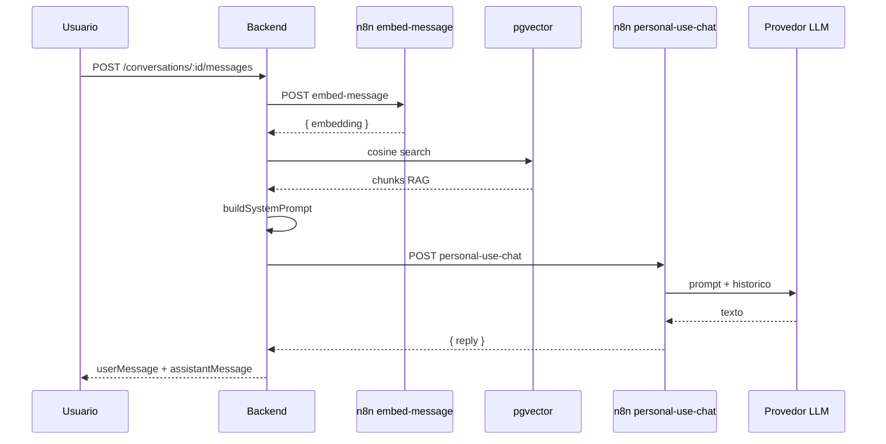

# Workflow 3 — Personal Use Chat (LLM)

> Status: **concluído**  
> Path do webhook: `personal-use-chat`  
> Última atualização: junho/2026

---

## Visão geral

Este workflow gera a **resposta do assistente** no chat interno (`personalUse`).
O backend já montou o `systemPrompt` (instruções + personalidade + contexto RAG) antes de chamar o n8n.

**Responsabilidades do n8n:**

- Receber payload do backend (webhook síncrono)
- Montar prompt de usuário com histórico da conversa
- Executar o LLM (AI Agent ou Basic LLM Chain)
- Retornar `{ reply: "..." }`

**O que o n8n não faz:**

- Embedding da pergunta (workflow `embed-message`)
- Busca no pgvector (backend `searchByAgent()`)
- Indexação de arquivos (workflow `knowledge-file-processing`)

---

## Arquitetura

```
Usuário envia mensagem no chat
  → Backend sendMessage()
  → searchByAgent() + embed-message (RAG)
  → buildSystemPrompt(+ knowledgeContext)
  → POST {N8N_URL}/personal-use-chat
  → [Este workflow]
  → LLM (Groq / Ollama Chat / etc.)
  → { reply }
  → Backend salva resposta do assistente
```

### Direção das chamadas

| De → Para | Protocolo |
| --- | --- |
| Backend → n8n | `POST {N8N_URL}/personal-use-chat` (síncrono) |
| n8n → LLM | API do provedor configurado no sub-node do Agent/Chain |

> Este workflow **não** usa ngrok nem `/api/internal/embed`. O ngrok na porta 3000
> é só para callbacks RAG e proxy de embeddings dos outros workflows.

### Pipeline completo (3 workflows)

| # | Workflow | Momento |
| --- | --- | --- |
| 2 | `knowledge-file-processing` | Upload → indexação |
| 1 | `embed-message` | A cada mensagem → embedding da pergunta |
| 3 | `personal-use-chat` | A cada mensagem → resposta LLM |

---

## Pré-requisitos

### Backend `.env`

```env
MOCK_AI=false
MOCK_RAG=false
N8N_URL="https://<instancia>.app.n8n.cloud/webhook"
N8N_WEBHOOK_SECRET="..."
```

### Variáveis no n8n (Settings → Variables)

| Variável | Uso |
| --- | --- |
| `N8N_WEBHOOK_SECRET` | Header `x-webhook-secret` (recomendado validar no workflow) |

Credenciais do LLM (Groq, OpenAI, etc.) ficam no **sub-node do modelo**, não em variáveis globais.

### Dependências

- WF #1 `embed-message` ativo (busca semântica no chat)
- WF #2 com arquivos `ready` + `vectors > 0` (se usar RAG)
- Workflow **Active** — produção usa `/webhook`, não `/webhook-test`

---

## Implementação em produção (validada)

Fluxo atual no n8n Cloud:

```
Webhook → Code preparar prompt → AI Agent → Code extrair → Respond 200
```

Variante da spec com auth (recomendada adicionar):

```
Webhook → validar secret → IF → Code preparar prompt → LLM → extrair → Respond 200
                          └→ Respond 401
```

---

## Node 1 — Webhook

| Parâmetro | Valor |
| --- | --- |
| HTTP Method | POST |
| Path | `personal-use-chat` |
| Authentication | None |
| Response Mode | **Using 'Respond to Webhook' Node** |

URL produção: `{N8N_URL}/personal-use-chat`  
URL teste (editor): `{N8N_URL}-test/personal-use-chat` — só com "Listen for test event"

---

## Node 2 (opcional) — Code `validar secret`

Mode: **Run Once for All Items**

```javascript
const item = $input.first().json;
const headers = item.headers || {};
const secret = headers['x-webhook-secret'] || headers['X-Webhook-Secret'];
const expected = $vars.N8N_WEBHOOK_SECRET;

if (secret !== expected) {
  return [{ json: { unauthorized: true } }];
}

const body = item.body ?? item;
return [{ json: { unauthorized: false, ...body } }];
```

---

## Node 3 (opcional) — IF → Respond 401

| Ramo | Condição | Destino |
| --- | --- | --- |
| True | `unauthorized` is true | Respond 401 |
| False | | Code preparar prompt |

---

## Node — Code `preparar prompt`

```javascript
const raw = $input.first().json;
const body = raw.body ?? raw;

const p = body.personality || {};
const systemPrompt = body.systemPrompt || 'Voce e um assistente util. Responda em portugues.';

const history = [...(body.history || [])];
const last = history[history.length - 1];
if (last?.role === 'user' && body.userMessage && last.content === body.userMessage) {
  history.pop();
}

const historyLines = history.map((msg) => {
  const label = msg.role === 'assistant' ? 'Assistente' : 'Usuario';
  return `${label}: ${msg.content}`;
});

let userPrompt = '';
if (historyLines.length) {
  userPrompt += 'Historico da conversa:\n' + historyLines.join('\n') + '\n\n';
}
userPrompt += 'Pergunta atual:\n' + (body.userMessage || '');

const temperature = (p.temperature ?? 50) / 100;
const maxTokens = { curta: 256, media: 512, longa: 1024 }[p.responseLength] || 512;

return [{ json: { systemPrompt, userPrompt, temperature, maxTokens } }];
```

> `knowledgeContext` vem **dentro** de `systemPrompt` (montado em `chat.prompt.ts`).
> O campo `knowledgeContext` no payload é redundante para o n8n.

---

## Node — LLM

### Opção A — AI Agent (implementação atual)

| Campo | Valor |
| --- | --- |
| System Message | `={{ $json.systemPrompt }}` |
| User Message / Prompt | `={{ $json.userPrompt }}` |

**Sub-node Chat Model:** Groq, Ollama Chat, OpenAI, etc.

| Campo | Valor |
| --- | --- |
| Temperature | `={{ $json.temperature }}` |
| Max Tokens | `={{ $json.maxTokens }}` |

### Opção B — Basic LLM Chain (spec alternativa)

| Campo | Valor |
| --- | --- |
| System Message | `={{ $('preparar prompt').item.json.systemPrompt }}` |
| Prompt (User) | `={{ $('preparar prompt').item.json.userPrompt }}` |

Mesmos parâmetros de temperature e maxTokens no sub-node Model.

---

## Node — Code `extrair resposta`

```javascript
let reply = 'Desculpe, nao consegui processar sua mensagem agora. Tente novamente.';
const raw = $input.first().json;
const content = raw.text ?? raw.output ?? raw.response?.text;

if (content && String(content).trim()) {
  reply = String(content).trim();
}

return [{ json: { reply } }];
```

AI Agent costuma expor o texto em `output`; Basic LLM Chain em `text`.

---

## Node — Respond to Webhook `200`

| Parâmetro | Valor |
| --- | --- |
| Respond With | JSON |
| Response Body | `={{ $json }}` ou `={{ { reply: $json.reply } }}` (modo **Expression**) |
| Response Code | 200 |

**Contrato obrigatório:**

```json
{
  "reply": "Texto da resposta do assistente."
}
```

Body vazio ou sem `reply` → backend retorna erro 500.

---

## Payload do backend

Enviado por `llm.client.ts` → `generateReply()`:

```json
{
  "systemPrompt": "Instrucoes...\n\nDiretrizes de estilo...\n\n[trechos RAG]",
  "history": [
    { "role": "user", "content": "mensagem anterior" },
    { "role": "assistant", "content": "resposta anterior" }
  ],
  "userMessage": "nova mensagem",
  "personality": {
    "temperature": 55,
    "creativity": 60,
    "formality": 65,
    "objectivity": 60,
    "technicalLevel": 70,
    "writingStyle": "detalhado",
    "emojiUsage": "nunca",
    "responseLength": "longa"
  },
  "knowledgeContext": "..."
}
```

Header: `x-webhook-secret: {N8N_WEBHOOK_SECRET}`

---

## Integração no backend

| Arquivo | Função |
| --- | --- |
| `chat.service.ts` | `sendMessage()` — orquestra RAG + LLM |
| `chat.prompt.ts` | `buildSystemPrompt()` — inclui RAG no system |
| `llm.client.ts` | `generateReply()` — chama webhook `personal-use-chat` |
| `knowledge.service.ts` | `searchByAgent()` — antes do LLM |

### Logs esperados

```
INFO [chat] RAG concluido { hits: 2, contextChars: 3507, scores: [...] }
INFO [llm] Gerando resposta via N8N personal-use-chat { knowledgeContextChars: 3507, ... }
INFO [n8n] Webhook personal-use-chat OK { durationMs: 1222 }
INFO [llm] Resposta LLM recebida { replyLength: 1523 }
INFO [chat] Mensagem processada com sucesso { durationMs: 4786, ... }
```

---

## Teste manual

```bash
curl -X POST "https://SEU-N8N.app.n8n.cloud/webhook/personal-use-chat" \
  -H "Content-Type: application/json" \
  -H "x-webhook-secret: SEU_N8N_WEBHOOK_SECRET" \
  -d '{
    "systemPrompt": "Voce e um assistente util. Responda em portugues.",
    "history": [],
    "userMessage": "oi",
    "personality": { "temperature": 50, "responseLength": "media" }
  }'
```

Resposta esperada: `{ "reply": "..." }` com texto não vazio.

### Teste end-to-end (chat + RAG)

1. Arquivo `ready` com `vectors > 0`
2. `MOCK_AI=false`, `MOCK_RAG=false`
3. Pergunta sobre conteúdo da planilha (ex.: `"ghg"`)
4. Logs: `knowledgeContextChars > 0` antes do LLM

---

## Troubleshooting

| Erro | Causa | Solução |
| --- | --- | --- |
| 404 no webhook | Workflow inativo ou `/webhook-test` no backend | Active + `N8N_URL=/webhook` |
| 403 Authorization | Header Auth no Webhook node | Authentication = None |
| Body vazio no backend | Respond com JSON estático | Response Body em Expression `={{ $json }}` |
| `N8N respondeu sem campo reply` | LLM Chain/Agent sem extrair texto | Code `extrair resposta` após LLM |
| Resposta genérica sem dados da base | RAG retornou 0 hits | Pergunta mais específica; ver WF #1 e #2 |
| Resposta ignora personalidade | temperature/maxTokens não ligados ao modelo | Mapear `$json.temperature` e `$json.maxTokens` |
| Chat lento (~5s) | Normal: embed-message + LLM em sequência | Esperado no pipeline completo |

---

## Checklist go-live

- [x] Workflow **Active** no n8n
- [x] `MOCK_AI=false` no backend
- [x] Responde `{ "reply": "..." }` (nunca body vazio)
- [x] Chat end-to-end com RAG validado nos logs
- [ ] Validar secret no workflow (recomendado)
- [ ] Temperature/maxTokens ligados ao sub-node do modelo

---

## Diagrama



---

## Referências cruzadas

- Embed da pergunta (RAG): [`embed-message.md`](embed-message.md)
- Indexação de arquivos: [`file-processor.md`](file-processor.md)
- Integração geral: [`documentation/BACKEND-INTEGRACAO.md`](../../BACKEND-INTEGRACAO.md) (seção 7.2)
- Backend: `llm.client.ts`, `chat.service.ts`, `chat.prompt.ts`
